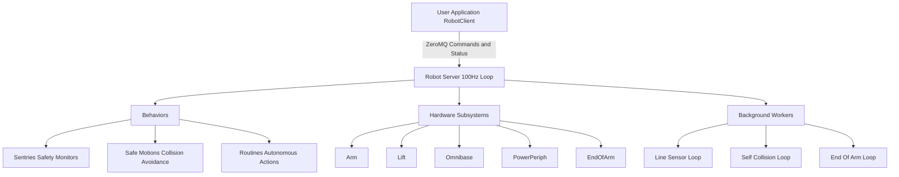

# Overview


The `stretch4_body` repository contains the core Python software stack that allows developers to interact with the hardware of Stretch 4 robots. The repository for Stretch 3 and below can be found in the [stretch_body](https://github.com/hello-robot/stretch_body) repo. This repo provides a robust, soft real-time capable framework for managing low-level motor communication, subsystem coordination, autonomous behaviors, and a high-level API for user applications. This repository is intended to be imported by other code that needs access to these features.

This package can be installed by:

```
python3 -m pip install -U hello-robot-stretch4-body
```

## Architecture Block Diagram

At its heart, the architecture is built around a Client-Server model. A dedicated `RobotServer` runs as a background daemon managing the physical hardware at 100Hz, executing safety monitoring, self-collision detection, and hardware command multiplexing. Developers build their applications using the `RobotClient`, which asynchronously communicates with the server over ZeroMQ. This decouples user scripts from strict hardware timing constraints and allows for safe, concurrent control of the robot.



## Technical Primers

For an in-depth understanding of how specific parts of the system are designed, refer to the following technical primers:

| Primer | Description |
|--------|-------------|
| [Core Architecture](./stretch4_body/core/primer_core.md) | Maps out the foundational classes, IPC communication, and file organization of the core library. |
| [Robot Parameters](./stretch4_body/robot/primer_robot_params.md) | Explains the multi-layered parameter system (default vs user) and dynamic runtime generation. |
| [Robot Client API](./stretch4_body/robot/primer_robot_client.md) | A guide to using the RobotClient API for reading status and commanding motion asynchronously. |
| [Hardware Subsystems](./stretch4_body/subsystem/primer_subsystems.md) | Overview of the primary hardware abstractions (Arm, Lift, Base) and how they are instantiated. |
| [End-Of-Arm EOA](./stretch4_body/subsystem/end_of_arm/primer_end_of_arm.md) | Details the dynamically instantiated, multi-process architecture for interchangeable tool attachments. |
| [Line Sensors](./stretch4_body/subsystem/line_sensor/pimer_line_sensor.md) | Details the operation and background processing for the downward-facing Pixart line sensors. |
| [Server Behaviors](./stretch4_body/behavior/primer_behaviors.md) | Explains the plugin architecture for Sentries, Safe Motions, and Routines within the 100Hz server loop. |
| [Self-Collision](./stretch4_body/behavior/sentries/primer_self_collision.md) | Details the MuJoCo-based collision checking system, its background loop, and configuration parameters. |
| [Gamepad Teleop](./stretch4_body/core/primer_gamepad_teleop.md) | Explains how different control schemes can be mapped onto a standard gamepad controller + how to extend it. |
| [Cameras](./stretch4_body/subsystem/cameras/primer_cameras.md) | A guide to the cameras on Stretch 4's head and wrist, with an overview of the CLIs and API. |

## Installation
 1. `pip3 install -e .`
 2. `stretch_body_server --launch`

 *Note: The C++ shared libraries for `transport` and `SCSerial` will compile automatically via Meson during the `pip install`.*

 If you want to install the object detection dependencies:

 ```bash
 pip3 install -e .[object_detection]
 ```

### Troubleshooting Editable Installs
If you make a C++ syntax error or typo in the source files and attempt to run a command while in editable mode (e.g., launching `stretch_body_server`), you may encounter an obscure Python exception instead of the actual C++ compiler error message:

```text
subprocess.CalledProcessError: Command '['ninja']' returned non-zero exit status 1.
```

Because `meson-python` editable builds run quietly in the background on import, it drops the standard output of the C++ compiler natively, hiding your C++ syntax error. To see the actual compiler output and locate the line where C++ failed, prepend your command with the verbose flag:

```bash
MESONPY_EDITABLE_VERBOSE=1 stretch_body_server --launch
```

