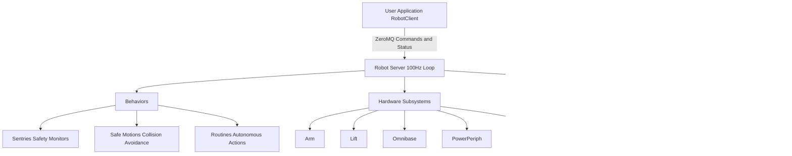

# Overview

The `stretch4_body` repository contains the core Python software stack that allows developers to interact with the hardware of Stretch 4 robots. The repository for Stretch 3 and below can be found in the [stretch_body](https://github.com/hello-robot/stretch_body) repo. This repo provides a robust, soft real-time capable framework for managing low-level motor communication, subsystem coordination, autonomous behaviors, and a high-level API for user applications. This repository is intended to be imported by other code that needs access to these features.

This package can be installed by:

```
python3 -m pip install -U hello-robot-stretch4-body
```

## Architecture Block Diagram

At its heart, the architecture is built around a Client-Server model. A dedicated `RobotServer` runs as a background daemon managing the physical hardware at 100Hz, executing safety monitoring, self-collision detection, and hardware command multiplexing. Developers build their applications using the `RobotClient`, which asynchronously communicates with the server over ZeroMQ. This decouples user scripts from strict hardware timing constraints and allows for safe, concurrent control of the robot.


```mermaid
graph TD
    ClientCode["User Application RobotClient"]
    Server["Robot Server 100Hz Loop"]

    Subsystems["Hardware Subsystems"]
    Arm
    Lift
    Omnibase
    PowerPeriph
    EndOfArm

    Behaviors["Behaviors"]
    Sentries["Sentries Safety Monitors"]
    SafeMotions["Safe Motions Collision Avoidance"]
    Routines["Routines Autonomous Actions"]

    Workers["Background Workers"]
    LineSensorLoop["Line Sensor Loop"]
    CollisionLoop["Self Collision Loop"]
    EOALoop["End Of Arm Loop"]

    ClientCode -->|ZeroMQ Commands and Status| Server

    Server --> Behaviors
    Behaviors --> Sentries
    Behaviors --> SafeMotions
    Behaviors --> Routines

    Server --> Subsystems
    Subsystems --> Arm
    Subsystems --> Lift
    Subsystems --> Omnibase
    Subsystems --> PowerPeriph
    Subsystems --> EndOfArm

    Server --> Workers
    Workers --> LineSensorLoop
    Workers --> CollisionLoop
    Workers --> EOALoop
```

## Technical Primers

For an in-depth understanding of how specific parts of the system are designed, refer to the following technical primers:

| Primer | Description |
|--------|-------------|
| [Core Architecture](./docs/primer_core.md) | Maps out the foundational classes, IPC communication, and file organization of the core library. |
| [Robot Parameters](./docs/primer_robot_params.md) | Explains the multi-layered parameter system (default vs user) and dynamic runtime generation. |
| [Robot Client API](./docs/primer_robot_client.md) | A guide to using the RobotClient API for reading status and commanding motion asynchronously. |
| [Hardware Subsystems](./docs/primer_subsystems.md) | Overview of the primary hardware abstractions (Arm, Lift, Base) and how they are instantiated. |
| [End-Of-Arm EOA](./docs/primer_end_of_arm.md) | Details the dynamically instantiated, multi-process architecture for interchangeable tool attachments. |
| [Line Sensors](./docs/primer_line_sensor.md) | Details the operation and background processing for the downward-facing Pixart line sensors. |
| [Server Behaviors](./docs/primer_behaviors.md) | Explains the plugin architecture for Sentries, Safe Motions, and Routines within the 100Hz server loop. |
| [Self-Collision](./docs/primer_self_collision.md) | Details the MuJoCo-based collision checking system, its background loop, and configuration parameters. |
| [Gamepad Teleop](./docs/primer_gamepad_teleop.md) | Explains how different control schemes can be mapped onto a standard gamepad controller + how to extend it. |
| [Agent Guardrails](./docs/primer_agent_guardrails.md) | How to keep an AI coding agent from running hardware commands, and the `stretch_package_create` scaffold that installs the guardrails. |
| [Cameras](./docs/primer_cameras.md) | A guide to the cameras on Stretch 4's head and wrist, with an overview of the CLIs and API. |

## Installation
 1. `pip3 install -e .`
 2. `stretch_body_server --launch`

 *Note: The C++ shared libraries for `transport` and `SCSerial` will compile automatically via Meson during the `pip install`.*

 If you want to install the object detection dependencies:

 ```bash
 pip3 install -e .[object_detection]
 ```

### Troubleshooting Editable Installs
If you make a C++ syntax error or typo in the source files and attempt to run a command while in editable mode (e.g., launching `stretch_body_server`), you may encounter an obscure Python exception instead of the actual C++ compiler error message:

```text
subprocess.CalledProcessError: Command '['ninja']' returned non-zero exit status 1.
```

Because `meson-python` editable builds run quietly in the background on import, it drops the standard output of the C++ compiler natively, hiding your C++ syntax error. To see the actual compiler output and locate the line where C++ failed, prepend your command with the verbose flag:

```bash
MESONPY_EDITABLE_VERBOSE=1 stretch_body_server --launch
```

## Custom User End-of-Arm Tools

Stretch 4 supports dynamic user-defined custom end-of-arm tools. Users can define, process, register, and switch to their own tools without modifying the core software stack.

### 1. Directory Structure

Custom tools should be placed in your fleet's `user_tools` directory:
- If environment variables `HELLO_FLEET_PATH` and `HELLO_FLEET_ID` are set: `<HELLO_FLEET_PATH>/<HELLO_FLEET_ID>/user_tools/`
- Otherwise (fallback): `~/stretch_user/user_tools/`

Create a subdirectory named after your tool (e.g., `user_eoa_mytool`):

```yaml
> user_eoa_mytool
    > meshes
        my_tool_mesh.stl      # Visual/Collision mesh files
    user_eoa_mytool.urdf      # Tool URDF file describing joints & links
    user_eoa_mytool.py        # Optional custom Python driver class
```

If your tool has custom driver code, the main Python file must match the tool directory name (e.g., `user_eoa_mytool.py`) or be named `tool.py`, and contain a class matching the tool name in PascalCase (e.g., `class UserEoaMytool`).

### 2. Mesh Preprocessing and Registration

Once your files are in place, process the tool using the automatic registration utility. This script simplifies visual meshes, generates collision meshes, and appends the default baseline configuration (including serial devices, joint exclusion, and collision management) to `stretch_user_params.yaml`:

```bash
stretch_configure_tool --add_user_tool
```

The tool will prompt you to select your custom tool subdirectory, process its URDF/meshes, and generate the parameters.

### 3. Switching to Your Tool

To switch your robot to use the custom tool:

```bash
stretch_configure_tool --quick --tool user_eoa_mytool
```

This updates `stretch_user_params.yaml` to make `user_eoa_mytool` the active tool. The `RobotClient`, `stretch_status`, and `stretch_system_check` utilities will automatically recognize, load, and poll your custom tool.


