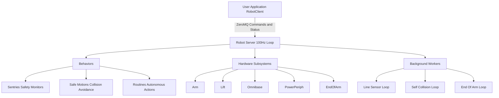

# Overview

The `stretch4_body` repository contains the core Python software stack that allows developers to interact with the hardware of Stretch 4 robots. The repository for Stretch 3 and below can be found in the [stretch_body](https://github.com/hello-robot/stretch_body) repo. This repo provides a robust, soft real-time capable framework for managing low-level motor communication, subsystem coordination, autonomous behaviors, and a high-level API for user applications. This repository is intended to be imported by other code that needs access to these features.

This package can be installed by:

```
python3 -m pip install -U hello-robot-stretch4-body
```

## Architecture Block Diagram

At its heart, the architecture is built around a Client-Server model. A dedicated `RobotServer` runs as a background daemon managing the physical hardware at 100Hz, executing safety monitoring, self-collision detection, and hardware command multiplexing. Developers build their applications using the `RobotClient`, which asynchronously communicates with the server over ZeroMQ. This decouples user scripts from strict hardware timing constraints and allows for safe, concurrent control of the robot.


```mermaid
graph TD
    ClientCode["User Application RobotClient"]
    Server["Robot Server 100Hz Loop"]

    Subsystems["Hardware Subsystems"]
    Arm
    Lift
    Omnibase
    PowerPeriph
    EndOfArm

    Behaviors["Behaviors"]
    Sentries["Sentries Safety Monitors"]
    SafeMotions["Safe Motions Collision Avoidance"]
    Routines["Routines Autonomous Actions"]

    Workers["Background Workers"]
    LineSensorLoop["Line Sensor Loop"]
    CollisionLoop["Self Collision Loop"]
    EOALoop["End Of Arm Loop"]

    ClientCode -->|ZeroMQ Commands and Status| Server

    Server --> Behaviors
    Behaviors --> Sentries
    Behaviors --> SafeMotions
    Behaviors --> Routines

    Server --> Subsystems
    Subsystems --> Arm
    Subsystems --> Lift
    Subsystems --> Omnibase
    Subsystems --> PowerPeriph
    Subsystems --> EndOfArm

    Server --> Workers
    Workers --> LineSensorLoop
    Workers --> CollisionLoop
    Workers --> EOALoop
```

## Technical Primers

For an in-depth understanding of how specific parts of the system are designed, refer to the following technical primers:

| Primer | Description |
|--------|-------------|
| [Core Architecture](./docs/primer_core.md) | Maps out the foundational classes, IPC communication, and file organization of the core library. |
| [Robot Parameters](./docs/primer_robot_params.md) | Explains the multi-layered parameter system (default vs user) and dynamic runtime generation. |
| [Robot Client API](./docs/primer_robot_client.md) | A guide to using the RobotClient API for reading status and commanding motion asynchronously. |
| [Hardware Subsystems](./docs/primer_subsystems.md) | Overview of the primary hardware abstractions (Arm, Lift, Base) and how they are instantiated. |
| [End-Of-Arm EOA](./docs/primer_end_of_arm.md) | Details the dynamically instantiated, multi-process architecture for interchangeable tool attachments. |
| [Line Sensors](./docs/primer_line_sensor.md) | Details the operation and background processing for the downward-facing Pixart line sensors. |
| [Server Behaviors](./docs/primer_behaviors.md) | Explains the plugin architecture for Sentries, Safe Motions, and Routines within the 100Hz server loop. |
| [Self-Collision](./docs/primer_self_collision.md) | Details the MuJoCo-based collision checking system, its background loop, and configuration parameters. |
| [Gamepad Teleop](./docs/primer_gamepad_teleop.md) | Explains how different control schemes can be mapped onto a standard gamepad controller + how to extend it. |
| [Cameras](./docs/primer_cameras.md) | A guide to the cameras on Stretch 4's head and wrist, with an overview of the CLIs and API. |

## Installation
 1. `pip3 install -e .`
 2. `stretch_body_server --launch`

 *Note: The C++ shared libraries for `transport` and `SCSerial` will compile automatically via Meson during the `pip install`.*

 If you want to install the object detection dependencies:

 ```bash
 pip3 install -e .[object_detection]
 ```

### Troubleshooting Editable Installs
If you make a C++ syntax error or typo in the source files and attempt to run a command while in editable mode (e.g., launching `stretch_body_server`), you may encounter an obscure Python exception instead of the actual C++ compiler error message:

```text
subprocess.CalledProcessError: Command '['ninja']' returned non-zero exit status 1.
```

Because `meson-python` editable builds run quietly in the background on import, it drops the standard output of the C++ compiler natively, hiding your C++ syntax error. To see the actual compiler output and locate the line where C++ failed, prepend your command with the verbose flag:

```bash
MESONPY_EDITABLE_VERBOSE=1 stretch_body_server --launch
```

## Custom User End-of-Arm Tools

Stretch 4 supports dynamic user-defined custom end-of-arm tools. Users can define, process, register, and switch to their own tools without modifying the core software stack.

### Overview

A tool is made of three independently-configured pieces. Each is described in detail in the
matching step below, but at a glance:

- **Driver** (`driver_class`, Step 1) — the server-side class that talks directly to your tool's
  physical motor/servo hardware from inside the 100Hz `RobotServer` loop. Required for any tool
  with a motor to control; omit it and the tool falls back to a passive, no-op driver
  (`EOA_Wrist_DW4_Tool_NIL`).
- **Metadata** (`ToolMetadata`, Step 2) — defines the conversions between the `urdf`/`command`/`actuator`/
  `aperture`/`normalized` units. Never performs hardware I/O itself. Most tools need no custom
  Python here: the built-in `LinearToolMetadata` handles any linear mapping from YAML keys alone;
  only a nonlinear transmission (e.g. a linkage) requires writing a bespoke subclass.
- **Client** (`client_class`, Step 2) — the `RobotClient`-facing class used by application code
  for `move_to()`, `move_by()`, `pose()`, and status reads. Optional: the generic `ToolJointClient` can handle single degree of freedom tools using the poses and conversions defined in the metadata. A bespoke client class may be required for more complex tools.

### 1. Directory Structure

Custom tools should be placed in your fleet's `user_tools` directory:
- If environment variables `HELLO_FLEET_PATH` and `HELLO_FLEET_ID` are set: `<HELLO_FLEET_PATH>/<HELLO_FLEET_ID>/user_tools/`
- Otherwise (fallback): `~/stretch_user/user_tools/`

Create a subdirectory named after your tool (e.g., `user_eoa_mytool`):

```yaml
> user_eoa_mytool
    > meshes
        my_tool_mesh.stl               # Visual/Collision mesh files
    user_eoa_mytool.urdf               # URDF file describing joints & links
    tool_params.yaml                   # YAML config
    user_eoa_mytool_driver.py          # Optional custom Python driver class
    user_eoa_mytool_client.py          # Optional custom Python RobotClient class
    user_eoa_mytool_metadata.py        # Optional custom Python ToolMetadata subclass
```

The three Python files above can be named anything you like — there is no filename or
class-name convention to follow, and nothing scans your directory guessing which file is
which. Each is wired up explicitly by a pair of keys in `tool_params.yaml`, pointing at a
module name (filename without `.py`) and the class within it:

```yaml
py_module_name: user_eoa_mytool_driver      # driver -- see Overview
py_class_name: UserEoaMytool

client_module_name: user_eoa_mytool_client  # client -- optional, see Overview
client_class_name: UserEoaMytoolClient

metadata_module_name: user_eoa_mytool_metadata  # metadata -- optional, see Overview and Step 2
metadata_class_name: UserEoaMytoolMetadata
```

All three are independently optional: omit `py_module_name`/`py_class_name` and the tool
falls back to a passive, no-op driver; omit `client_module_name`/`client_class_name` and it
falls back to the generic `ToolJointClient`; omit `metadata_module_name`/`metadata_class_name`
and it falls back to the built-in `LinearToolMetadata` (Step 2, Path A). See the Overview
above for what each piece does and when you actually need to provide one.

### 2. Configuring Unit Conversions

For actuated tools, the software works in five primary units.

| Unit | Description |
|---|---|
| `urdf` | The units used to define the joint in ROS's robot model, used with `JointTrajectory`, `JointState`, and other ROS topics
| `command` | The units expected by stretch4_body's `move_to()` and `move_by()` methods. stretch4_body will translate values into raw motor units, and raw motor readings back into these units to report status. |
| `actuator` | The true raw servo/motor register value (radians).|
| `aperture` | Physical fingertip opening (meters) — a client convenience unit. |
| `normalized` | 0.0 (closed) .. 1.0 (open) — another client convenience unit, e.g. for a UI slider |

Each tool is expected to provide a conversion path between each of the 5 units. There are two ways to configure this, depending on how your gripper's motor motion relates to
its physical motion:

**Path A — Linear tools.** To send motor commands directly without specialized conversations (no gearbox nonlinearity, no linkage), just add these keys to your
tool's `tool_params.yaml`:

```yaml
py_module_name: my_tool_driver
py_class_name: MyToolDriver

tool_joints: ['my_finger_left_joint', 'my_finger_right_joint']
primary_joint: 'my_finger_left_joint'   # optional, defaults to the first tool_joints entry
tool_links: ['my_finger_left_link', 'my_finger_right_link']

actuator_command_range: [0.0, 100.0]

# Physical fingertip opening bounds (meters)
aperture_range: [0.0, 0.08]

# Linear scale factor: command = urdf * urdf_to_actuator_scale. Optional, defaults to 1.0.
urdf_to_actuator_scale: 100.0

# How close to a commanded position counts as "arrived", in URDF units (meters or radians).
# Optional; defaults to 2% of the joint's URDF range. The ROS trajectory server uses this to
# decide when a gripper goal is finished, so a tolerance that is too tight will hang a
# trajectory and one that is too loose will end the motion early.
position_tolerance: 0.002
```

**Path B — Nonlinear tools.** If your motor's motion relates to the gripper's physical motion
through a linkage or other nonlinear transmission and a single
linear scale can't describe it, write your own `ToolMetadata` subclass and register it
in `tool_params.yaml`:

```yaml
py_module_name: my_tool_driver
py_class_name: MyToolDriver

client_module_name: my_tool_client
client_class_name: MyToolClient

metadata_module_name: my_tool_metadata
metadata_class_name: MyToolMetadata
```

Your subclass must implement every abstract member of `ToolMetadata`
(`stretch4_body/utils/tool_metadata.py`) — `tool_joints`, `tool_links`, `client_class`,
`driver_class`, `status_to_metadata`, the two ranges, and the six unit conversions:

```python
from stretch4_body.utils.tool_metadata import ToolMetadata

class MyToolMetadata(ToolMetadata):
    ...  # tool_joints, tool_links, client_class, driver_class

    @property
    def actuator_range(self) -> tuple[float, float]:
        """(min, max) true raw servo angle (radians)."""

    @property
    def command_range(self) -> tuple[float, float]:
        """(min, max) in whatever units your move_to()/move_by() actually accept."""

    def urdf_to_command(self, urdf: float) -> float:
        """URDF joint value -> your move_to()/move_by()'s own units."""

    def command_to_urdf(self, command: float) -> float:
        """Your move_to()/move_by()'s own units -> URDF joint value."""

    def command_to_actuator(self, command: float) -> float:
        """Your move_to()/move_by()'s own units -> true raw servo angle (radians)."""

    def actuator_to_command(self, actuator: float) -> float:
        """True raw servo angle (radians) -> your move_to()/move_by()'s own units."""

    def aperture_to_actuator(self, aperture: float) -> float:
        """Physical fingertip opening (meters) -> true raw servo angle (radians)."""

    def actuator_to_aperture(self, actuator: float) -> float:
        """True raw servo angle (radians) -> physical fingertip opening (meters)."""

    def status_to_metadata(self, status: dict) -> dict:
        """Raw hardware status -> {'aperture_m', 'finger_rad', 'finger_effort', 'finger_vel'}."""
```

`urdf_to_actuator`/`actuator_to_urdf` and the `normalized`/`aperture` conversions are provided
for you by the base class, chained through `command`/`actuator` — you only need to implement
the two ranges, the six conversions, and `status_to_metadata` shown above (plus `tool_joints`,
`tool_links`, `client_class`, `driver_class`, unchanged from a normal user tool). See
`ParallelGripperMetadata` (linkage-based) and `StretchGripperMetadata` (near-linear) in
`tool_metadata.py` for complete worked examples.

`position_tolerance` is also provided by the base class, defaulting to 2% of the joint's URDF
range. Override the property if your tool needs a different arrival threshold — the ROS
trajectory server reads it to decide when a gripper goal is complete.

### 3. Mesh Preprocessing and Registration

Once your files are in place, process the tool using the automatic registration utility. This script simplifies visual meshes, generates collision meshes, and appends the default baseline configuration (including serial devices, joint exclusion, and collision management) to `stretch_user_params.yaml`:

```bash
stretch_configure_tool --add_user_tool
```

The tool will prompt you to select your custom tool subdirectory, process its URDF/meshes, and generate the parameters.

### 4. Switching to Your Tool

To switch your robot to use the custom tool, run the configuration tool and pick it from the
menu:

```bash
stretch_configure_tool
```

Custom tools are not auto-detected on the Feetech bus, so choose the **"Enter a custom tool
name"** option at the end of the list and type your tool's directory name (`user_eoa_mytool`).
Add `--quick` to skip the power-cycle and bus-scan steps and go straight to the selection
prompt:

```bash
stretch_configure_tool --quick
```

This updates `stretch_user_params.yaml` to make `user_eoa_mytool` the active tool, then offers
to restart `stretch_body_server` and home the tool. The `RobotClient`, `stretch_status`, and
`stretch_system_check` utilities will automatically recognize, load, and poll your custom tool
from there.


