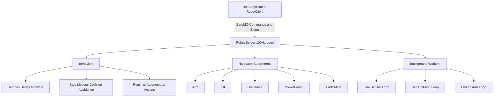

# Overview

The `stretch4_body` repository contains the core Python software stack that allows developers to interact with the hardware of Stretch 4 robots. The repository for Stretch 3 and below can be found in the [stretch_body](https://github.com/hello-robot/stretch_body) repo. This repo provides a robust, soft real-time capable framework for managing low-level motor communication, subsystem coordination, autonomous behaviors, and a high-level API for user applications. This repository is intended to be imported by other code that needs access to these features.

This package can be installed by:

```
python3 -m pip install -U hello-robot-stretch4-body
```

## Architecture Block Diagram

At its heart, the architecture is built around a Client-Server model. A dedicated `RobotServer` runs as a background daemon managing the physical hardware at 100Hz, executing safety monitoring, self-collision detection, and hardware command multiplexing. Developers build their applications using the `RobotClient`, which asynchronously communicates with the server over ZeroMQ. This decouples user scripts from strict hardware timing constraints and allows for safe, concurrent control of the robot.


```mermaid
graph TD
    ClientCode["User Application RobotClient"]
    Server["Robot Server 100Hz Loop"]

    Subsystems["Hardware Subsystems"]
    Arm
    Lift
    Omnibase
    PowerPeriph
    EndOfArm

    Behaviors["Behaviors"]
    Sentries["Sentries Safety Monitors"]
    SafeMotions["Safe Motions Collision Avoidance"]
    Routines["Routines Autonomous Actions"]

    Workers["Background Workers"]
    LineSensorLoop["Line Sensor Loop"]
    CollisionLoop["Self Collision Loop"]
    EOALoop["End Of Arm Loop"]

    ClientCode -->|ZeroMQ Commands and Status| Server

    Server --> Behaviors
    Behaviors --> Sentries
    Behaviors --> SafeMotions
    Behaviors --> Routines

    Server --> Subsystems
    Subsystems --> Arm
    Subsystems --> Lift
    Subsystems --> Omnibase
    Subsystems --> PowerPeriph
    Subsystems --> EndOfArm

    Server --> Workers
    Workers --> LineSensorLoop
    Workers --> CollisionLoop
    Workers --> EOALoop
```

## Technical Primers

For an in-depth understanding of how specific parts of the system are designed, refer to the following technical primers:

| Primer | Description |
|--------|-------------|
| [Core Architecture](./docs/primer_core.md) | Maps out the foundational classes, IPC communication, and file organization of the core library. |
| [Robot Parameters](./docs/primer_robot_params.md) | Explains the multi-layered parameter system (default vs user) and dynamic runtime generation. |
| [Robot Client API](./docs/primer_robot_client.md) | A guide to using the RobotClient API for reading status and commanding motion asynchronously. |
| [Hardware Subsystems](./docs/primer_subsystems.md) | Overview of the primary hardware abstractions (Arm, Lift, Base) and how they are instantiated. |
| [End-Of-Arm EOA](./docs/primer_end_of_arm.md) | Details the dynamically instantiated, multi-process architecture for interchangeable tool attachments. |
| [Line Sensors](./docs/primer_line_sensor.md) | Details the operation and background processing for the downward-facing Pixart line sensors. |
| [Server Behaviors](./docs/primer_behaviors.md) | Explains the plugin architecture for Sentries, Safe Motions, and Routines within the 100Hz server loop. |
| [Self-Collision](./docs/primer_self_collision.md) | Details the MuJoCo-based collision checking system, its background loop, and configuration parameters. |
| [Gamepad Teleop](./docs/primer_gamepad_teleop.md) | Explains how different control schemes can be mapped onto a standard gamepad controller + how to extend it. |
| [Cameras](./docs/primer_cameras.md) | A guide to the cameras on Stretch 4's head and wrist, with an overview of the CLIs and API. |

## Installation
 1. `pip3 install -e .`
 2. `stretch_body_server --launch`

 *Note: The C++ shared libraries for `transport` and `SCSerial` will compile automatically via Meson during the `pip install`.*

 If you want to install the object detection dependencies:

 ```bash
 pip3 install -e .[object_detection]
 ```

### Troubleshooting Editable Installs
If you make a C++ syntax error or typo in the source files and attempt to run a command while in editable mode (e.g., launching `stretch_body_server`), you may encounter an obscure Python exception instead of the actual C++ compiler error message:

```text
subprocess.CalledProcessError: Command '['ninja']' returned non-zero exit status 1.
```

Because `meson-python` editable builds run quietly in the background on import, it drops the standard output of the C++ compiler natively, hiding your C++ syntax error. To see the actual compiler output and locate the line where C++ failed, prepend your command with the verbose flag:

```bash
MESONPY_EDITABLE_VERBOSE=1 stretch_body_server --launch
```

## Custom User End-of-Arm Tools

Stretch 4 supports dynamic user-defined custom end-of-arm tools. Users can define, process, register, and switch to their own tools without modifying the core software stack. For step by step instructions on adding a new tool, see [Adding a Custom End-of-Arm
Tool](./docs/guide_custom_eoa_tool.md).

### Overview

A tool is made of three independently-configured pieces. Each is described in detail in the
matching step below, but at a glance:

- **Driver** (`driver_class_name`) — the server-side class that talks directly to your
  tool's physical motor/servo hardware from inside the 100Hz `RobotServer` loop. Declaring it is
  what adds your servo to the wrist bus. A tool that declares no driver is passive: it keeps the
  bare 3-DOF wrist and the `EOA_Wrist_DW4_Tool_NIL` subsystem.
- **Metadata** (`ToolMetadata`) — defines the conversions between the `urdf`/`command`/`actuator`/
  `aperture`/`normalized` units. The built-in `LinearToolMetadata` can handle any linear mapping from YAML keys alone;
  but a nonlinear transmission (e.g. a linkage) requires writing a bespoke subclass.
- **Client** (`client_class`) — the `RobotClient`-facing class used by application code
  for `move_to()`, `move_by()`, `pose()`, and status reads. The generic `ToolJointClient` can handle single degree of freedom tools using the poses and conversions defined in the metadata. A bespoke client class may be required for more complex tools.

### Directory Structure

Custom tools live in the fleet's `user_tools` directory:
- If `HELLO_FLEET_PATH` is set: `<HELLO_FLEET_PATH>/user_tools/`
- Otherwise (fallback): `~/stretch_user/user_tools/`

A tool's subdirectory is named after the tool itself (e.g., `user_eoa_tool`) — the directory name
*is* the tool name, and one that collides with a built-in tool's name is ignored.

```yaml
> user_eoa_tool
    > meshes
        my_tool_link.STL               # Visual meshes, referenced by the URDF
        my_tool_collision_link.STL     # Collision meshes, generated in Step 3
    user_eoa_tool.urdf               # URDF describing joints & links -- exactly one per tool
    collision_mesh_config.yaml         # Per-link collision mesh recipe -- see Step 3
    tool_params.yaml                   # YAML config
    user_eoa_tool_driver.py          # Python driver class for the tool's actuator(s)
    user_eoa_tool_client.py          # Optional custom Python RobotClient class
    user_eoa_tool_metadata.py        # Optional custom Python ToolMetadata subclass
```

A tool's URDF root link must be name `quick_connect_interface_link`. This is how the tool attaches to
the end of the robot's wrist. `SE4.xacro` includes the tool's URDF and then adds a fixed `tool_connection_joint`
which mates the the robot's `tool_attachment_site_link` and with a tool's `quick_connect_interface_link`.

Any custom python modules for tools are connected with a pair of keys in `tool_params.yaml`, pointing at a
module name (filename without `.py`) and the class within it:

```yaml
driver_module_name: user_eoa_tool_driver      # driver -- see Overview
driver_class_name: UserEoaTool

client_module_name: user_eoa_tool_client  # client -- optional, see Overview
client_class_name: UserEoaToolClient

metadata_module_name: user_eoa_tool_metadata  # metadata -- optional, see Overview and Step 2
metadata_class_name: UserEoaToolMetadata
```

All three are independently optional. Omit `driver_module_name`/`driver_class_name` and the tool
stays passive. Omit `client_module_name`/`client_class_name` and it
falls back to the generic `ToolJointClient`. Omit `metadata_module_name`/`metadata_class_name`
and it falls back to the built-in `LinearToolMetadata`. See the Overview
above for what each piece does and when you actually need to provide one.

A tool starts from the bare 3-DOF wrist. Declaring a driver adds its servo to the end-of-arm
chain under the tool's own name. A tool's `tool_params.yaml` provides any required servo configuration
parameters.

```yaml
# Required: this servo's bus address, travel, and which way it homes.
id: 24                              # servo id on the wrist bus, unique across tools
range_deg: [0, 187]                 # mechanical travel
homing_to_neg_limit: 1
homing_pwm: -80                     # sign sets the homing direction
flip_encoder_polarity: 1

# Optional: anything else that differs from the baseline defined in robot_params_SE4.py
eeprom_cfg:
  max_load_limit_pct: 20.0          # this tool's fingers pull less than the baseline allows

stow:
  my_tool_joint: 0.0                # optional stow position, in command units (defaults to 0)

homing:
  wrist_roll: -0.4                  # optional final position after homing, in actuator units (defaults to 0)

i_feedforward_payload: 0.3          # optional lift feedforward current for this tool's weight, in amps (defaults to 0.0)
```


`homing` sets where `wrist_pitch`, `wrist_roll` and `wrist_yaw` are left when each finishes homing, defaulting to 0. This can be helpful to keep the end effector out of the way while the wrist is homing and collision is off. The end-of-arm will home the yaw joint, then the roll joint, the pitch joint, and finally the tool joints. Each will hold its final position while the next homes to its hardstop.

`i_feedforward_payload` adds to the lift's feedforward current (amps, 0.0-1.0) to counterbalance
the added weight of the arm, wrist and tool, so the lift doesn't have to close a position error to
hold against gravity. It defaults to 0.0; a tool with real mass that leaves it unset will sag
under its own weight and lean on the lift's position control to hold height. See
`Lift.set_i_feedforward_payload` in `subsystem/lift.py`.

`collision_mgmt` declares brake distances and collision pairs against the rest of the robot body
for a tool that can reach the base or mast, so the lift or arm brakes before contact rather than
after. `k_brake_distance` pads a joint's stopping distance by the given multiplier;
`collision_pairs` names which of the tool's links to check against which robot links (as a point
against a bounding box, via `detect_as: 'pts'`); `joints` maps a joint to the collision pairs and
direction (`motion_dir`) that should brake it. Omitting `collision_mgmt` means the tool
participates in no such check. See `SE4_eoa_wrist_dw4_tool_pg4` in `robot/robot_params_SE4.py` for
a worked example — its parallel gripper hangs below the wrist and needs the lift to brake before
it reaches the base.

`self_collision_mujoco` configures this tool's participation in the self-collision system (see
`docs/primer_self_collision.md`), which uses MuJoCo to check the tool's links against the rest of
the robot at runtime. Omitting it leaves the tool with no exclusions: every pair of its links,
including pairs that naturally overlap at a joint (e.g. adjacent fingers), is checked, and an
overlapping pair with no exclusion falsely reports a collision.

```yaml
self_collision_mujoco:
  exclusions:
    - ['my_tool_finger_left_link', 'my_tool_finger_right_link']  # allowed to touch/overlap
  ignore_links: ['my_tool_camera_link']    # skipped by the collision engine entirely
  k_brake_distance:
    wrist_pitch: 1.1                       # multiplies this joint's required braking distance
```

`pose_models` is a list of named joint poses for this tool, readable with
`RobotPose.load_tool_pose_models(tool_name)` (`stretch4_body/utils/stretch_pose_models.py`). Each
entry needs `name` and `timestamp`; `joints` maps a joint name to a `position` (that joint's
command units), plus `velocity` and `effort` — recorded alongside a live capture, harmless to
leave at `0.0` for a pose you write by hand. `base` and `delay_before_start` are optional. For
example, a "stow" pose that tucks `my_tool_joint` to zero:

```yaml
pose_models:
  - name: stow
    timestamp: 0.0
    joints:
      my_tool_joint:
        position: 0.0    # command units, same as tool_joints/stow above
        velocity: 0.0
        effort: 0.0
```

### Tool Units

For actuated tools, the software works in five primary units.

| Unit | Description |
|---|---|
| `urdf` | The units used to define the joint in ROS's robot model, used with `JointTrajectory`, `JointState`, and other ROS topics
| `command` | The units expected by stretch4_body's `move_to()` and `move_by()` methods. stretch4_body will translate values into raw motor units, and raw motor readings back into these units to report status. |
| `actuator` | The servo/motor register value (radians).|
| `aperture` | Physical fingertip opening (meters) — a client convenience unit. |
| `normalized` | 0.0 (closed) .. 1.0 (open) — another client convenience unit, e.g. for a UI slider |

Each tool provides a conversion path between each of the 5 units through their metadata object.

**A rate does not convert like a position.** For a position conversion `y = f(x)`, a velocity
transforms by the derivative: `ẏ = f'(x)·ẋ`. Running a rate through the position conversion is
incorrect whenever `f` is not a pure scaling through the origin — either because it carries an
offset (`f(0) ≠ 0`, as when a fully-closed gripper sits at a nonzero servo angle), or because it
is nonlinear (the gain varies with position, as across PG4's slider-crank linkage).

So `ToolMetadata` provides a separate family of differential conversions:

| Method | Use for |
|---|---|
| `convert_velocity(v, frm, to, at)` | A rate. Multiplies by the Jacobian evaluated at position `at`. |
| `convert_delta(d, frm, to, at)` | A finite displacement (a `move_by` amount). Computed exactly as `f(at + d) - f(at)`, so it needs no derivative and stays exact across a nonlinear transmission. **Prefer this whenever the quantity really is a displacement.** |
| `convert_acceleration(a, frm, to, at)` | A motion-profile acceleration limit. First-order only. |
| `conversion_gain(frm, to, at)` | The Jacobian itself — the partial derivative `d(to)/d(frm)` at `at`, if you want to multiply yourself. |
| `velocity_limit(unit_type, at)` / `conservative_velocity_limit(unit_type)` | This tool's servo velocity limit pushed through the Jacobian into other units: `\|d(unit_type)/d(actuator)\| * limit_actuator`. The conservative form minimizes that over the range, giving a rate achievable at every position — use it when you need one scalar. |

Named wrappers exist for the common pairs, e.g. `urdf_to_command_velocity(v, at_urdf)` and
`actuator_to_urdf_velocity(v, at_actuator)`.

**`at` is required, not optional** — for a nonlinear tool there is no position-independent answer
— and it is expressed in the *source* units. `ToolMetadata` is stateless, so the caller supplies
the current position, typically from `status['pos']`.

A subclass gets velocity support for free, since the base class differentiates the six position
conversions above numerically — though because a Path B transmission is nonlinear by definition,
overriding `_analytic_gain(frm, to, at)` with a closed-form derivative is exact and cheaper. The
numeric fallback has two failure modes: rounding or quantizing inside a conversion function makes
the derivative meaningless (a small enough step can return exactly zero), and a conversion that
raises at the edges of its range breaks it.

One asymmetry: a tool driver's `move_to(x, v_r, a_r)` takes its *position* in command units but
its `v_r`/`a_r` in **actuator rad/s**, since those are servo motion-profile limits — a rate held
in command units needs `command_to_actuator_velocity()` first.

