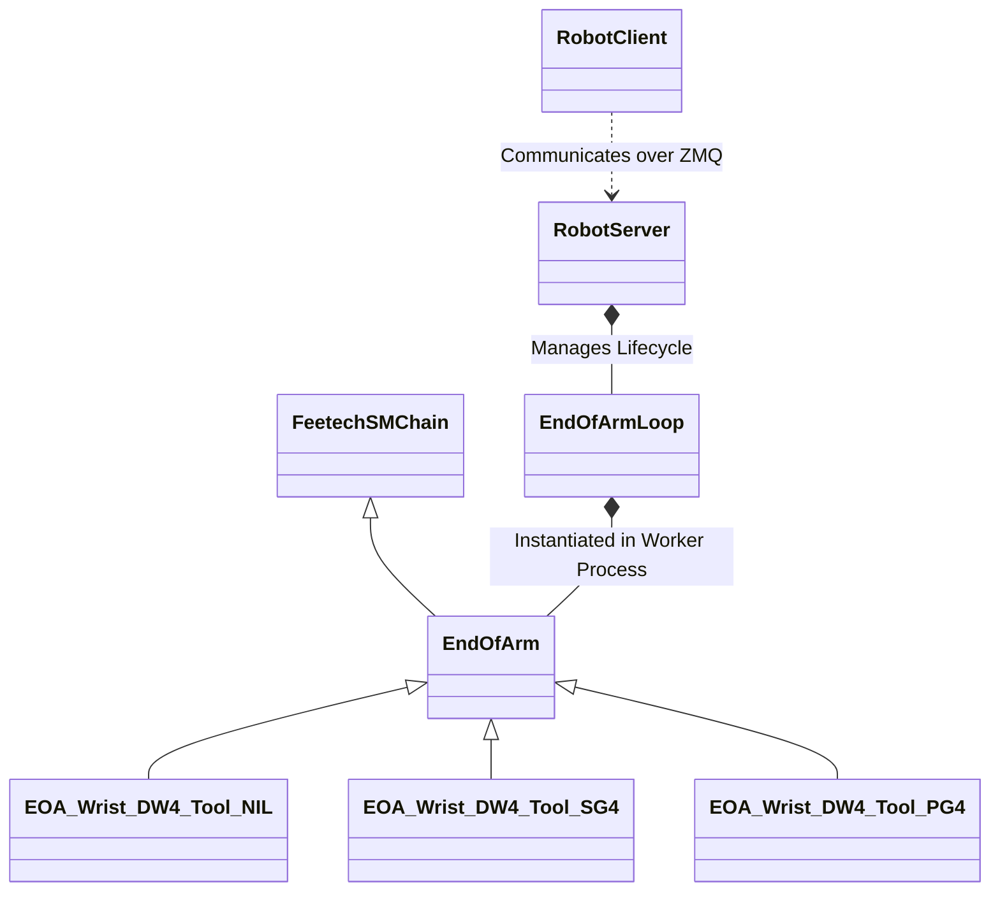
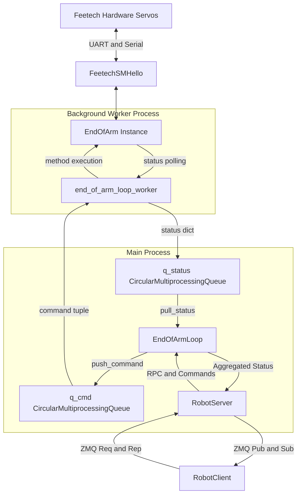

# End of Arm Subsystem Documentation

The `end_of_arm` subsystem is responsible for controlling the various tools and joints attached to the distal end of the robot's arm, such as the wrist (yaw, pitch, roll) and the gripper. It is designed to be highly modular, supporting a wide range of custom and factory tool attachments.

## Modular Architecture and Tool Determination

The modularity of the end-of-arm system is heavily reliant on the `RobotParams` system. At runtime, the `EndOfArmLoop` reads the user's YAML configuration to determine exactly which tool is installed on the robot.

It does this by looking up the `eoa_name` property and then instantiating the class dynamically via Python's `importlib`:
```python
rp = RobotParams._robot_params
eoa_name = RobotParams.eoa_name
module_name = rp[eoa_name]['py_module_name']
class_name = rp[eoa_name]['py_class_name']
eoa = getattr(importlib.import_module(module_name), class_name)()
```
This architecture allows users to define custom end-of-arm tools by simply creating a Python class that inherits from `EndOfArm` and specifying its module/class name in their `stretch_user_params.yaml`. Note that changing the active tool is done by setting 

```
robot:
  tool: eoa_name
```
in the user yaml.

### Actuation Component: Feetech Servos

All actuation at the end-of-arm is driven by **Feetech** smart serial servos. The base `EndOfArm` class inherits from `FeetechSMChain`, meaning that the end-of-arm is treated as a daisy-chained serial bus of Feetech motors. Each individual joint (like `wrist_pitch`, `wrist_roll`, or `stretch_gripper`) corresponds to a `FeetechSMHello` instance that sits on this chain.

## Class Hierarchy

The following diagram illustrates the class hierarchy and ownership from the low-level Feetech chain up to the client application:



## Multiprocessing and Control Rate

Communicating with multiple serial servos on a shared bus can cause I/O latency. To maintain a solid **50Hz** control and status update rate, the `end_of_arm` subsystem relies on Python multiprocessing.

The `EndOfArmLoop` spins up a separate background `Process` that runs the `end_of_arm_loop_worker`. Inside this worker, a high-frequency loop constantly calls `eoa.pull_status()` to read from the servos over the serial port. 

Because this happens in an isolated process, any serial port blocking or I/O delays do not interrupt the main `RobotServer` application loop. The server manages this by providing two `CircularMultiprocessingQueue` objects:
- `q_status`: The worker drops fresh state dictionaries here; the main process reads them.
- `q_cmd`: The main process drops RPC commands (like `move_to`) here; the worker executes them against the `EndOfArm` instance.

## Control Flow State Diagram

The flow of commands and data moves bidirectionally through the multiprocess queues and ZMQ transport.



## Available Tools

There are several command-line tools available for interacting with the `end_of_arm` subsystem, testing joints, and calibrating the system, including:

*   `stretch_dex_wrist_home.py`: Homes the full 3-DOF dexterous wrist.
*   `stretch_dex_wrist_jog.py`: Interactively jog the yaw, pitch, and roll axes of the wrist.
*   `stretch_gripper_home.py`: Homes the end-of-arm gripper.
*   `stretch_gripper_jog.py`: Interactively open and close the gripper.
*   `stretch_wrist_yaw_home.py`, `stretch_wrist_pitch_home.py`, `stretch_wrist_roll_home.py`: Individually home specific wrist joints.
*   `REx_feetech_backlash_measure.py`: Factory tool designed to measure mechanical backlash in the Feetech servos.
*   `REx_feetech_id_change.py`: Factory tool to change the ID of a Feetech servo.
*   `REx_feetech_id_scan.py`: Factory tool to scan the serial bus for active Feetech IDs.
*   `REx_feetech_jog.py`: Factory tool to interactively jog individual Feetech servos.
*   `REx_feetech_reboot.py`: Factory tool to soft-reboot a Feetech servo.
*   `REx_feetech_set_baud.py`: Factory tool to change the baud rate of a Feetech servo.
