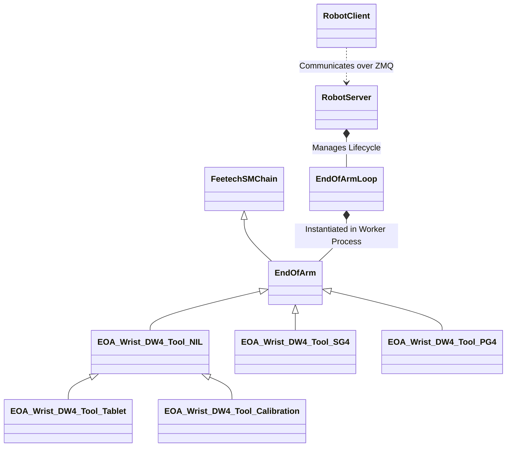
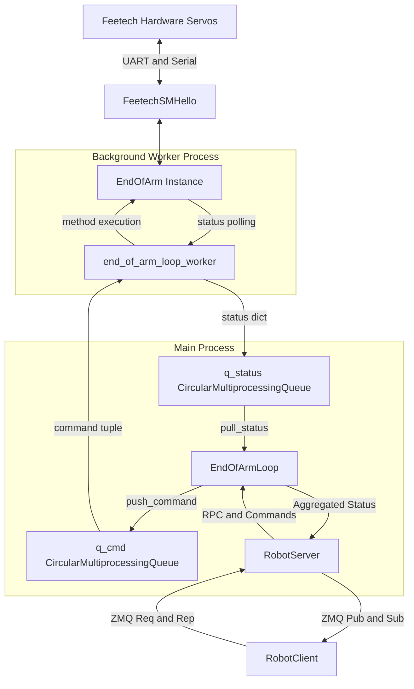

# End of Arm Subsystem Documentation

The `end_of_arm` subsystem is responsible for controlling the various tools and joints attached to the distal end of the robot's arm, such as the wrist (yaw, pitch, roll) and the gripper. It is designed to be highly modular, supporting a wide range of custom and factory tool attachments.

This primer covers how the subsystem is put together and how to drive whatever tool is on the wrist. To build a custom tool from scratch, see "Custom User End-of-Arm Tools" in the top-level README.

The code lives in `stretch4_body/subsystem/end_of_arm/`:

```
end_of_arm.py                       the EndOfArm chain base class
end_of_arm_loop.py                  the worker process that owns the EndOfArm instance
end_of_arm_tools.py                 the built-in EndOfArm subclasses
wrist_pitch.py wrist_roll.py wrist_yaw.py   drivers shared by every DW4 tool
stretch_gripper.py parallel_gripper.py      the two built-in gripper drivers
```

## Modular Architecture and Tool Determination

The modularity of the end-of-arm system is heavily reliant on the `RobotParams` system. At runtime, the `EndOfArmLoop` reads the user's YAML configuration to determine exactly which tool is installed on the robot.

It does this by looking up the `eoa_name` property and then instantiating the class dynamically:
```python
eoa_name = RobotParams.eoa_name
rp = RobotParams._robot_params
module_name = rp[eoa_name]['py_module_name']
class_name = rp[eoa_name]['py_class_name']
eoa = getattr(RobotParams.import_user_tool_module(eoa_name, module_name, is_server=True), class_name)()
```

`import_user_tool_module` is what makes a user tool work: a built-in names its driver with a dotted package path and is imported normally, while a user tool names a bare module such as `end_of_arm`, which is resolved against that tool's own directory under `user_tools`. A user tool declares its module and class names in the `tool_params.yaml` beside its driver, and a built-in declares the same keys in its Python dict in `robot_params_SE4.py`.

Changing the active tool is done by setting

```
robot:
  tool: eoa_name
```

in the user yaml, which is what `stretch_configure_tool` writes for you.

### Actuation Component: Feetech Servos

All actuation at the end-of-arm is driven by **Feetech** smart serial servos. The base `EndOfArm` class inherits from `FeetechSMChain`, meaning that the end-of-arm is treated as a daisy-chained serial bus of Feetech motors. Each individual joint (like `wrist_pitch`, `wrist_roll`, or `stretch_gripper`) corresponds to a `FeetechSMHello` instance that sits on this chain.

## Class Hierarchy

The following diagram illustrates the class hierarchy and ownership from the low-level Feetech chain up to the client application:


```mermaid
classDiagram
    FeetechSMChain <|-- EndOfArm
    EndOfArm <|-- EOA_Wrist_DW4_Tool_NIL
    EndOfArm <|-- EOA_Wrist_DW4_Tool_SG4
    EndOfArm <|-- EOA_Wrist_DW4_Tool_PG4
    EOA_Wrist_DW4_Tool_NIL <|-- EOA_Wrist_DW4_Tool_Tablet
    EOA_Wrist_DW4_Tool_NIL <|-- EOA_Wrist_DW4_Tool_Calibration

    EndOfArmLoop *-- EndOfArm : Instantiated in Worker Process
    RobotServer *-- EndOfArmLoop : Manages Lifecycle
    RobotClient ..> RobotServer : Communicates over ZMQ
```

A user tool supplies its own `EndOfArm` subclass, or inherits `EOA_Wrist_DW4_Tool_NIL`, which drives the three wrist joints and leaves any tool joint alone.

## Multiprocessing and Control Rate

Communicating with multiple serial servos on a shared bus can cause I/O latency. To maintain a solid **50Hz** control and status update rate, the `end_of_arm` subsystem relies on Python multiprocessing.

The `EndOfArmLoop` spins up a separate background `Process` that runs the `end_of_arm_loop_worker`. Inside this worker, a high-frequency loop constantly calls `eoa.pull_status()` to read from the servos over the serial port. 

Because this happens in an isolated process, any serial port blocking or I/O delays do not interrupt the main `RobotServer` application loop. The server manages this by providing two `CircularMultiprocessingQueue` objects:
- `q_status`: The worker drops fresh state dictionaries here; the main process reads them.
- `q_cmd`: The main process drops RPC commands (like `move_to`) here; the worker executes them against the `EndOfArm` instance.

## Control Flow State Diagram

The flow of commands and data moves bidirectionally through the multiprocess queues and ZMQ transport.


```mermaid
flowchart TD
    A[Feetech Hardware Servos] <-->|UART and Serial| B[FeetechSMHello]
    B <--> C[EndOfArm Instance]
    
    subgraph Background Worker Process
        C -->|status polling| D[end_of_arm_loop_worker]
        D -->|method execution| C
    end
    
    D -->|status dict| E[q_status CircularMultiprocessingQueue]
    I[q_cmd CircularMultiprocessingQueue] -->|command tuple| D
    
    subgraph Main Process
        E -->|pull_status| F[EndOfArmLoop]
        F -->|push_command| I
        F -->|Aggregated Status| G[RobotServer]
        G -->|RPC and Commands| F
    end

    G -->|ZMQ Pub and Sub| H[RobotClient]
    H -->|ZMQ Req and Rep| G
```

## Driving a tool

`EndOfArm` is the server-side Feetech chain that runs inside the 100Hz `RobotServer` loop and talks to the motors. `EndOfArmClient` is what application code holds, and it forwards commands over RPC. Both take the joint name first:

```python
robot.end_of_arm.move_to('wrist_yaw', 1.57)     # radians, joint named as in `devices`
robot.end_of_arm.pose('wrist_yaw', 'forward')
robot.end_of_arm.home()
robot.end_of_arm.stow()
```

The client additionally exposes each joint as its own attribute, named by its key in the tool's `devices` parameters, so a joint can be handed around on its own:

```python
yaw = robot.end_of_arm.wrist_yaw            # a WristJointClient
yaw.move_to(1.57)
yaw.status['pos']
```

### Reaching the tool joint

Every DW4 tool carries `wrist_pitch`, `wrist_roll` and `wrist_yaw` under those names. The *tool* joint is the one that varies: SG4 calls it `stretch_gripper`, PG4 calls it `parallel_gripper`, and a user tool calls it whatever its `devices` key says.

`EndOfArmClient` resolves that joint through the tool's `ToolMetadata` and aliases it as `gripper`, so `robot.end_of_arm.gripper` is the handle that works for any tool:

```python
g = robot.end_of_arm.gripper                # a ToolJointClient, or the tool's own client class
g.move_to(0.05)                             # in this tool's command units
g.pose('open')
g.tool_metadata.command_to_aperture(0.05)   # convert when you need a shared unit
```

Prefer `gripper` over the joint's real name, and go through `tool_metadata` rather than assuming what a number means — `move_to(0.05)` is 5cm of fingertip aperture on PG4 and a near-closed Pct value on SG4. Converting from a shared unit first asks for the same physical result on either:

```python
m = g.tool_metadata
g.move_to(m.aperture_to_command(0.05))      # 5cm of fingertip opening, whatever the tool
g.move_to(m.normalized_to_command(1.0))     # fully open, whatever the tool
g.move_to(m.command_range[0])               # fully closed, without knowing the number
```

Read it back the same way. `status['pos']` is in the tool's own units, but every tool publishes `status['gripper_conversion']`, which `ToolMetadata.status_to_metadata()` fills with `aperture_m`, `finger_rad`, `finger_effort` and `finger_vel`:

```python
g.status['gripper_conversion']['aperture_m']    # meters, comparable across tools
```

`get_tool_metadata()` in `utils/tool_metadata.py` returns the same object outside a client, and the top-level README's "Configuring Unit Conversions" describes the five units and the conversions between them.

A tool with no actuator has no `gripper` attribute at all, so guard with `hasattr` in code that must also run on the bare wrist or the tablet.

## Where user tools differ

Both kinds end up as `nominal_params[<tool name>]` and are driven through the same API above. What differs is where each piece comes from, and what you get when the tool supplies nothing.

| | Built-in tool | User tool |
|---|---|---|
| Parameters | A dict in `robot/robot_params_SE4.py` | `tool_params.yaml`, deep-merged over `SE4_eoa_wrist_dw4_tool_nil` |
| Module names | Dotted package paths | Bare names resolved against the tool's own directory by `RobotParams.import_user_tool_module` |
| `EndOfArm` subclass | In `end_of_arm_tools.py` | Its own, or `EOA_Wrist_DW4_Tool_NIL`, which drives the three wrist joints and leaves a tool joint alone |
| `EndOfArmClient` subclass | `<py_class_name>_Client` in `robot_client.py` | Its own, or one synthesized at runtime from `EndOfArmClient` bound to the tool's name |
| Tool joint client | Declared by the tool's metadata | `ToolJointClient`, unless the tool declares one |
| `ToolMetadata` | Looked up in `BUILTIN_TOOL_MODELS` | Its own subclass, or `LinearToolMetadata` built from YAML keys |

The practical consequences for code that has to work with both:

* **Import nothing tool-specific.** A built-in driver is importable from this package; a user tool's driver only exists on `sys.path` once `RobotParams.add_user_tool_to_sys_path` has run. Reach classes through `get_tool_metadata()` — `driver_class` and `client_class` — rather than importing.
* **Expect the generic client.** A user tool usually gets `ToolJointClient`, which offers `move_to`/`move_by`/`set_velocity`/`pose`/`status` and little else. Feature-detect anything beyond that.
* **Ask before you act.** `robot.end_of_arm.is_tool_present(class_name)` and `is_tool_joint(name)` in `utils/tool_metadata.py` answer what is attached without importing it.
* **A misconfigured user tool raises.** `get_tool_metadata()` raises `ToolConfigurationError` when a tool declares itself actuated but is missing a required key, rather than degrading to a plain joint.

## SE4 robot params

Every tool's parameters resolve into `nominal_params[<tool name>]`, which is the dict `EndOfArm` and `EndOfArmClient` both see as `self.params`. To read them outside a subsystem:

```python
from stretch4_body.core.robot_params import RobotParams

_, robot_params = RobotParams.get_params()
tool_name = robot_params['robot']['tool']
tool_params = robot_params[tool_name]           # devices, stow, class names, conversions
```

`RobotParams.reload()` re-reads the fleet YAML and rescans `user_tools`, which is needed after `stretch_configure_tool` writes a new tool or a test drops one on disk.

The built-in definitions live in `robot/robot_params_SE4.py`:

| Name | What it holds |
|---|---|
| `SE4_eoa_wrist_dw4_tool_nil` / `_sg4` / `_pg4` / `_tablet` / `_calibration` | One dict per built-in tool, taking the keys in the next table. `_nil` is also the baseline every user tool is merged over. |
| `SE4_wrist_pitch_DW4` / `SE4_wrist_roll_DW4` / `SE4_wrist_yaw_DW4` | Per-servo motor parameters for the three wrist joints — id, `eeprom_cfg`, `motion`, range. A device entry names one of these in `device_params`. |
| `SE4_stretch_gripper_DW4` / `SE4_parallel_gripper_DW4` | The same for the two built-in grippers. SG4's also carries `gripper_conversion`, the finger length and aperture bounds its metadata reads. |
| `supported_eoa` / `supported_eoa_metadata` | The tool list and the display names `stretch_configure_tool` offers. User tool directories are appended to both at import. |
| `nominal_params` | Where each tool dict is registered under its tool name, near the bottom of the file. |

## tool_params.yaml reference

A user tool states these in `tool_params.yaml`; a built-in states the same keys in its Python dict. Every one is optional — the loader starts from a deep copy of `SE4_eoa_wrist_dw4_tool_nil` and deep-merges the tool's own values over it, so a tool states only what differs from the bare 3-DOF wrist.

| Key | Meaning |
|---|---|
| `py_class_name` / `py_module_name` | The `EndOfArm` subclass. Built-ins use a dotted module path because they live in the package; a user tool uses a bare name like `end_of_arm`, resolved against its own directory. |
| `client_class_name` / `client_module_name` | Optional `EndOfArmClient` subclass, same bare-name rule. |
| `metadata_class_name` / `metadata_module_name` | Optional `ToolMetadata` subclass, for hardware the generic unit conversions do not fit. |
| `tool_joints` / `tool_links` / `actuator_command_range` / `aperture_range` | Read by `LinearToolMetadata`, and required once `tool_joints` is set — a missing one raises `ToolConfigurationError` at startup rather than degrading quietly. `primary_joint` (defaults to the first `tool_joints` entry), `urdf_to_actuator_scale` (defaults to 1.0) and `position_tolerance` are optional. A passive tool sets none of these. |
| `stow` | Per-joint stow targets, each in that joint's command units. `EOA_Wrist_DW4_Tool_NIL` stows only the three wrist joints, so a target for a tool joint needs an `EndOfArm` subclass that moves it. |
| `homing` | Where `wrist_pitch`, `wrist_roll` and `wrist_yaw` are left when each finishes homing, in radians, defaulting to 0. Joints home yaw, then roll, then pitch, so a value on yaw or roll holds that joint clear while pitch sweeps to its hardstop. |
| `devices` | One entry per servo on the wrist bus. **Key order sets the order motors are added to the Feetech chain** — a user tool's entries land after the three inherited wrist joints. `device_params` names one of the per-servo dicts above; a custom servo inlines its motor parameters instead. Each servo needs an `id` no other tool uses, or `stretch_configure_tool`'s bus scan can mistake one tool for the other. |
| `collision_mgmt` | Brake distances and collision pairs against the robot body. A tool hanging below the wrist needs this so the lift brakes before the tool reaches the base; `SE4_eoa_wrist_dw4_tool_pg4` is the worked example. |
| `self_collision_mujoco` | `exclusions` are link pairs that touch by design and must not be reported as self-collisions. Link names must match the tool's URDF. |
| `ros` | Extra ROS command groups the tool contributes, appended to `nominal_params['ros']['joints']`. |

## Heads Up

* A velocity is not converted like a position. If your tool's unit conversions are affine or nonlinear, use `ToolMetadata`'s differential conversions (`convert_velocity`, `convert_delta`, `conversion_gain`) rather than passing a rate through `urdf_to_command()` and other position conversions, and override `_analytic_gain()` if your transmission is nonlinear. See "Converting velocities" under Path B in the top-level README.

* `move_to(x, v_r, a_r)` takes its position in the tool's command units but its `v_r` and `a_r` in actuator rad/s, since those are servo motion-profile limits. Convert a rate held in command units with `command_to_actuator_velocity()` first.

* If your tool defines a custom `ToolMetadata` subclass, your driver and your metadata module will reference each other: the driver uses the metadata class to convert command units to actuator radians, and the metadata's `driver_class` property has to return the driver class. To avoid circularity, import the driver module from inside that property rather than at module scope.

* ROS params will reject a new value if it differs from the existing type. Be mindful of integer vs. float values (`0` and `0.0` are not interchangeable). If the new value is rejected, the parameter will stay set to the old value.

* PyYAML reads bare `on`, `off`, `yes`, `no` as booleans. Quote them if you want them as strings.

* `1e6` parses as a string, not a number. Write `1.0e+6` for the float equivalent.

## Available Tools

There are several command-line tools available for interacting with the `end_of_arm` subsystem, testing joints, and calibrating the system, including:

*   `stretch_dex_wrist_home`: Homes the full 3-DOF dexterous wrist.
*   `stretch_dex_wrist_jog`: Interactively jog the yaw, pitch, and roll axes of the wrist.
*   `stretch_gripper_home`: Homes the end-of-arm gripper.
*   `stretch_gripper_jog`: Interactively open and close the gripper.
*   `stretch_wrist_yaw_home`, `stretch_wrist_pitch_home`, `stretch_wrist_roll_home`: Individually home specific wrist joints.
*   `stretch_configure_tool`: Swap the active end-of-arm tool and home it.
*   `REx_feetech_backlash_measure.py`: Factory tool designed to measure mechanical backlash in the Feetech servos.
*   `REx_feetech_id_change.py`: Factory tool to change the ID of a Feetech servo.
*   `REx_feetech_id_scan.py`: Factory tool to scan the serial bus for active Feetech IDs.
*   `REx_feetech_jog.py`: Factory tool to interactively jog individual Feetech servos.
*   `REx_feetech_reboot.py`: Factory tool to soft-reboot a Feetech servo.
*   `REx_feetech_set_baud.py`: Factory tool to change the baud rate of a Feetech servo.
