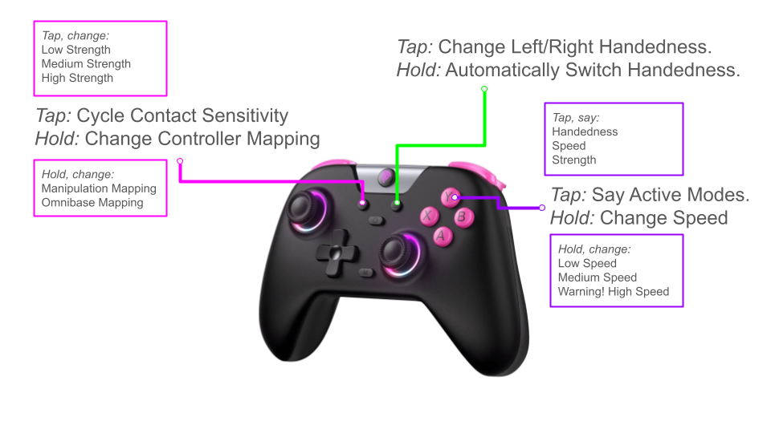

# Gamepad Teleop for Stretch

This document explains the usage of the Gamepad Teleoperation interface for the Stretch robot.

## Overview

The `GamePadTeleop` class maps gamepad inputs (Xbox controller) to robot motions. It supports multiple control mappings, mode switching, and custom user functions.

## Key Features

### Mode Switching

- **Motion Profile**: Hold the **Top Button (Y)** for 2 seconds to cycle between motion profiles (e.g., Default, Slow, Fast).
- **Control Mapping**: Hold the **Select (Back) Button** for 2 seconds to cycle between control mappings (Default, Analog Wrist, Manipulation).
- **Contact Sensitivity**: Short press the **Select (Back) Button** to cycle contact sensitivity profiles.

### Special Functions

- **Homing**: If the robot is not homed, press the **Start Button** to home the robot.
- **Gripper Handedness**: If the robot is homed, hold the **Start Button** for 3 seconds to switch gripper handedness (Left/Right). The robot will perform a motion to reorient the gripper if safe.
- **Shutdown**: Hold the **Select (Back) Button** for 10 seconds to stow the robot and shut down the onboard PC.

## Control Mappings

The system supports three main control mappings:

### 1. Omnibase Mapping
Teleoperation mapping that mixes both manipulation controls with the d-pad and omnibase movement with the analog sticks.
- **Sticks**: Control Arm (Left Stick Y), Lift (Right Stick Y), and Base (Left Stick X/Y, Right Stick X).
- **Bumpers (LB/RB)**: Wrist Yaw.
- **D-Pad**: Wrist Pitch (Up/Down) and Wrist Roll (Left/Right).
- **Buttons**: Gripper Open/Close (A/B).

### 2. Manipulation Mapping
Designed for wrist control using analog inputs. Wrist and arm controls are separated from omnibase movement using the right-trigger.
- **Triggers**:
    - **Left Trigger (>0.9)**: Precision Mode (Slower movements).
    - **Right Trigger (>0.9)**: Manipulation Mode.
- **Manipulation Mode**:
    - Right Stick X/Y controls Wrist Yaw and Pitch.
    - D-Pad Left/Right controls Wrist Roll.

## Customization

You can customize the behavior by:
- Modifying `gamepad_control_mappings.py` to add or edit mappings.
- Setting `params['function_cmd']` in user parameters to execute a shell command via the **Function Button (Xbox / Left Button)**.
