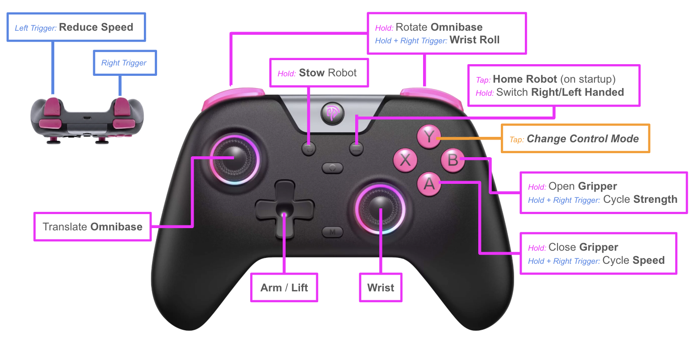

# Gamepad Teleop

## Gamepad Teleop for Stretch

Stretch 4 ships with a gamepad controller for teleoperation.

You can start the gamepad teleop script by running `stretch_gamepad_teleop` in the command line, or from the Stretch Tray icon in the system tray.

> Note: `stretch_gamepad_teleop` uses a RobotClient. Make sure the Stretch Body Server is running using `stretch_body_server --status`.

### Homing from Gamepad Teleop

When you boot Stretch 4, the robot needs to be homed (auto-calibrated). You may notice that the controller vibrates and does not allow you to move the robot. If this happens, make sure the robot's surroundings are clear, and press the `Start` button on the controller to Home (calibrate) the joints.

### Running in the background

You can keep the `stretch_gamepad_teleop` application script running in the background while you run other RobotClient applications. The `stretch_gamepad_teleop` script will timeout and stop sending commands to the server after a few milliseconds of not receiving inputs.&#x20;

> Note that `stretch_gamepad_teleop` has a higher priority on the RobotClient command queue, so commands from it will override other scripts by default.

### Controller Mappings

By default, `stretch_gamepad_teleop` has two control mapping modes that you can switch between using `Y`.&#x20;

The first is Joint Control, which allows you to control each joint individually.&#x20;

The second is Flying Gripper Control, which allows you to use the `Right Stick` to move the wrist, and move towards where the gripper is pointing using the `Left Stick`. This mode is useful for manipulation and grasping objects.



<figure><figcaption></figcaption></figure>



<figure><figcaption></figcaption></figure>



### Changing Speed and Strength

Tap or hold the `Right Trigger + A` to change or cycle the speed of Stretch 4. By default it is Medium speed. This cycles between Low, Medium and High speed presets.&#x20;

> Be careful when navigating with Medium or High speed. It is a good idea to keep the arm retracted or Stow the robot (Hold `Select`) while the robot is moving in the environment.

Tap or hold the `Right Trigger + B` to change or cycle the strength of Stretch 4. By default it is Medium strength. This cycles between Low, Medium and High strength presets. Use Low strength when manipulating the robot near people, and High strength when trying to manipulate objects that require more force, like opening a door.

> Strength affects the contact sensitivity thresholds. Low strength will stop joint motion when encountering a small motor effort.

### Special Functions

* **Homing**: If the robot is not homed, press the `Start` button to home the robot.
* **Gripper Handedness**: If the robot is homed, hold the `Start` button for 3 seconds to switch gripper handedness (Left/Right).
* **Stowing**: Hold the `Select` button for 3 seconds to stow the robot.

## Customization

You can customize the behavior by:

* Modifying `gamepad_control_mappings.py` to add or edit mappings.
* Setting `params['function_cmd']` in user parameters to execute a shell command via the `X` button.
