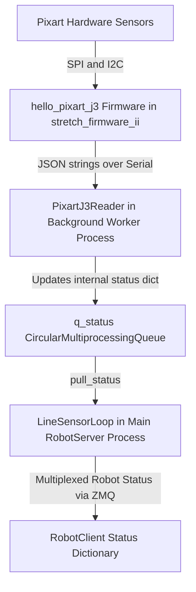

# Line Sensor System Documentation

The line sensor system is designed to provide high-speed, reliable distance measurements across an array of up to 6 Pixart sensors, streaming firehose serial data into a multiprocessing architecture.

## Status Fields (`LineSensorLoop`)

The `LineSensorLoop` class pulls status from a multiprocessing queue and populates its internal `status` dictionary. The data comes directly from `PixartJ3Reader`.

### Global Status Fields
*   `last_frame_time`: Timestamp indicating when the last complete frame (all 6 sensors) was processed.
*   `rate_hz`: The overall update rate of the complete frame, expected to hover around 30Hz.
*   `frame_advance_err`: Counter tracking instances where the sequential frame ID from the microcontroller does not advance exactly by 1 (indicates out of order or dropped frames).
*   `not_six_sensors_err`: Counter for when a frame is deemed "processed" but it did not contain data for all 6 sensors.
*   `frame_not_full_err`: Counter for when a frame ID increments before all 6 sensors for the *previous* frame ID were received.
*   `sensors_last_frame`: A dictionary containing occurrences of each sensor index seen in the last processed frame.

### Per-Sensor Status Fields (`sensor_0` through `sensor_5`)
*   `ts_last_read`: The timestamp when this specific sensor's data was most recently read.
*   `frame_id`: Sequential identifier assigned by the sensor/microcontroller.
*   `rate_hz`: The update rate calculated specifically for this sensor's data arrivals.
*   `ranges`: Array of distance readings (typically 320 elements) reported by the sensor in meters.

## Relevant Parameters

The line sensor system behavior is shaped by parameters passed to `LineSensorLoop`, which are loaded from user config files.

*   `loop_rate_Hz`: Defines the speed of the background `worker_loop` process. Because reading from the serial port is async to the sensors, running this at a high rate (e.g., 100Hz or faster) ensures minimal latency.
*   `sensor_names`: List of logical names for the sensors initialized in the status dictionary (e.g., `['sensor_0', ..., 'sensor_5']`).
*   `bus_sensor_map`: A nested list `[[2, 3], [0, 1], [4, 5]]` that maps hardware I2C/SPI bus numbers and device numbers directly to a linear logical index (0-5).
*   `flip_range_ordering`: Boolean parameter that dictates whether the `ranges` array should be reversed. Used to correct for physical sensor orientations relative to the robot body.

## Multiprocessing Architecture

Achieving a stable 30Hz control rate requires handling a firehose of JSON strings over a serial port without blocking the main robot control thread. 

The system leverages Python's `multiprocessing.Process` to place the `PixartJ3Reader` into an isolated process. This background process runs `worker_loop`, a highly optimized loop executing at `loop_rate_Hz`. It continually polls the serial interface, parses JSON strings, extracts the array data, and builds frames. 

Because all of this parsing and aggregation logic is isolated from the main application via multiprocessing, it does not interrupt or throttle the primary control loop, guaranteeing that the robot can comfortably process data while maintaining a solid 30Hz system loop rate.

## Flow of Control

The data lifecycle moves from the serial port to the main application through several stages:

1.  **Serial Reader:** The background process rapidly calls `PixartJ3Reader.step()`. This method reads bytes from the serial buffer, pieces together JSON lines, and assigns the range data to specific sensor dictionaries based on the `bus_sensor_map`.
2.  **Status Compilation:** Once `PixartJ3Reader` determines a frame is complete or out-of-order, it updates its internal `status` dictionary to reflect the latest state of all arrays and diagnostic counters.
3.  **Queue Transport:** The `worker_loop` captures this updated dictionary and pushes it onto a non-blocking `CircularMultiprocessingQueue` (`q_status`).
4.  **Main Process Polling:** The main control application calls `LineSensorLoop.pull_status()`. This function flushes out all stale entries from `q_status` and updates the primary `status` dictionary with only the freshest data available.
5.  **Consumer Access:** Any higher-level modules simply read the array using `LineSensorLoop.status['sensor_X']['ranges']`.

## Associated Tools

There are several tools available to diagnose, calibrate, and visualize the line sensor system:

*   `REx_line_sensor_calibrate.py`: Factory tool used for calibrating the line sensor arrays.
*   `stretch_line_sensor_viz_3d.py`: Visualization tool that opens an interactive 3D rendering of the line sensor ranges. Includes features like `--nice_viz` and `--odom` for mapping the ground surface using live robot odometry.

## Data Flow Architecture

The block diagram below illustrates the flow of line sensor data from the hardware sensors all the way to the client application interface.

