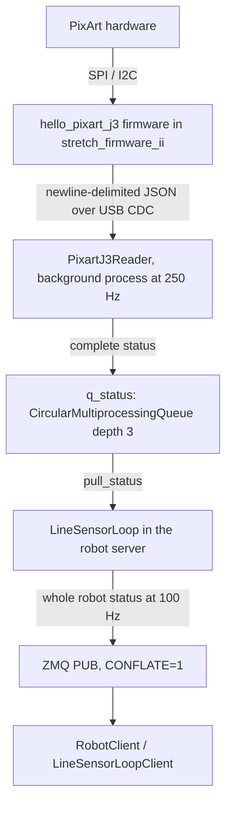

# Line Sensor System Documentation

Six PixArt J3 sensors ring the base, each pointing down and forward, each
reporting 320 range bins at ~30 Hz. Together they see the floor immediately
around the robot: obstacles, and cliffs.

The firmware streams newline-delimited JSON over a USB CDC port
(`/dev/hello-pixart-j3`). A background process decodes it; the robot server
publishes it; clients consume it over ZMQ.

## The status codes come first

A bin does not always carry a distance. The chip has two status codes:

| raw | metres | meaning |
|---|---|---|
| `0xFF80` | 5.11 | **No detection at all.** No reflection came back. Ambiguous: a dark floor, a lighting condition, or a void. |
| `0xFE80` | 5.09 | **Detected, but beyond the range limit.** Something returned from further than the sensor can measure. |

Because the sensors point *down*, 5.09 is the stronger cliff evidence: the beam
travelled past where the floor should have been and found something far away.

These are classified **once**, at decode, in `line_sensor/protocol.py`, before
any conversion or correction:

* `ranges[bin]` is set to `NaN` wherever the bin is not a distance;
* `codes[bin]` carries the identity (`CODE_VALID`, `CODE_BEYOND_LIMIT`,
  `CODE_NO_RETURN`, `CODE_OTHER_INVALID`).

## Status schema

### `health` — subsystem-wide

| field | meaning |
|---|---|
| `streaming` | decoding is running. **False means no cliff detection.** |
| `port_open` | the serial port is open. False during a dropout. |
| `disabled_sensors` | names switched off at runtime, by choice |
| `sensors_dead` | names not reporting, by fault. Empty during normal operation. |
| `rate_hz` | whole-frame rate, ~30 Hz |
| `reader_restarts` | serial recoveries so far. A climbing number means a flaky cable. |
| `decode_errors`, `frame_advance_err`, `frame_not_full_err`, `not_six_sensors_err` | counters; all should stay flat |

`disabled` and `dead` are deliberately different: one is a choice, the other is
a fault. A disabled sensor never appears in `sensors_dead`.

### `sensor_0` … `sensor_5` — per sensor

| field | meaning |
|---|---|
| `ranges` | float64[320], metres, `NaN` at every non-measurement bin |
| `codes` | uint8[320], `protocol.CODE_*` — the authority on 5.09 vs 5.11 |
| `n_no_return`, `n_beyond_limit` | counts of each code this report |
| `missed_frames` | consecutive frames not reported; 0 while healthy |
| `enabled` | False if switched off at runtime |
| `frame_id`, `ts_last_read`, `rate_hz` | |

### `calibration` — served by the body

The tare is loaded, fingerprint-checked and published **by the robot**, so no
consumer opens a YAML file or repeats the validation

| field | meaning |
|---|---|
| `loaded` | names with an accepted tare |
| `rejected` | `{name: why}` for every refusal |
| `id` | changes when the calibration changes; cache on this |
| `sensor_N` | packed tare |

## Parameters

Under `line_sensor_loop` in the robot params:

* `loop_rate_Hz` — 250. The reader polls far faster than the sensors report.
* `sensor_names` — `sensor_0` … `sensor_5`, clockwise from robot forward.
* `bus_sensor_map` — **`[[1, 0], [3, 2], [5, 4]]`**. Maps `distances<bus><dev>`
  in the JSON to a logical sensor index. Change it if the cables are plugged in
  differently.
* `flip_range_ordering` — whether to reverse each 320-bin array.
* `line_sensor_geometry` — FOV, mounting angles, emitter height and pitch
  diameter, `pixart_report_num`.

`bus_sensor_map` and `flip_range_ordering` **raise if missing** rather than
defaulting. A wrong bin order mirrors every reading left-to-right and nothing
downstream can detect it; a wrong bus map rotates the whole ring. Six identical
60-degree wedges tile the circle, so *any* mapping error produces a complete,
plausible-looking result. Only a physical observation can catch it — occlude
one wedge and confirm the expected sensor index responds.

## Two lossy hops, and what that forces


```mermaid
flowchart TD
    A[PixArt hardware] -->|SPI / I2C| B[hello_pixart_j3 firmware in stretch_firmware_ii]
    B -->|newline-delimited JSON over USB CDC| C[PixartJ3Reader, background process at 250 Hz]
    C -->|complete status| D[q_status: CircularMultiprocessingQueue depth 3]
    D -->|pull_status| E[LineSensorLoop in the robot server]
    E -->|whole robot status at 100 Hz| F[ZMQ PUB, CONFLATE=1]
    F --> G[RobotClient / LineSensorLoopClient]
```

Both transports **drop**:

* `q_status.put()` discards the *oldest* message when full. The reader puts at
  250 Hz; the control loop drains at 48–100 Hz; the queue is 3 deep.
* The ZMQ status socket sets `CONFLATE=1` on both ends, so a subscriber only
  ever holds the newest message.

That single fact drives two rules:

1. **Every status message carries all six sensors.** a dropped
   delta loses that sensor's frame permanently, and the symptom — one sensor
   frozen while five stream — is indistinguishable from a hardware fault.
2. **The calibration rides every message.** Publishing it once would be
   conflated away for any client that connected a moment later, leaving it
   silently uncalibrated.

`q_cmd` is the exception: it is 100 deep, because dropping the oldest *command*
means a `set_streaming(False)` quietly does not happen.

## Calibration

Flat-floor tare: park on a clean, light, flat floor with nothing within ~0.5 m,
record, and subtract the difference between what each bin measures and the
ideal floor depth.

```
REx_line_sensor_calibrate --all
REx_line_sensor_calibrate -s sensor_1 --print-per-bin
REx_line_sensor_calibrate --all --dry-run
REx_line_sensor_calibrate --recompute <session_id>     # no robot needed
```

What it will and will not do:

* Status-code samples never enter the arithmetic. A bin that mostly returns
  5.09/5.11 is rejected, not averaged.
* A run is **refused** if too many bins fail — a partial tare is worse than
  none, because nothing downstream can tell a bad correction from a good one.
  A dark or glossy floor produces exactly this.
* Each raw session is one `session.npz`, so a tare can be recomputed later
  without the robot.
* A stored tare records a **configuration fingerprint** (bus map, flip,
  report count, geometry, code mapping). On mismatch it is *refused*, never
  downgraded to a warning and never quietly replaced with an older file.

## Runtime control

```python
from stretch4_body.robot.robot_client import RobotClient
r = RobotClient(); r.startup()
ls = r.line_sensor_loop

ls.set_streaming(False)                  # pause all six
ls.set_sensor_enabled('sensor_3', False) # or just one
r.push_command()                         # nothing happens without this

ls.is_streaming(); ls.disabled_sensors(); ls.dead_sensors()
```

Neither setting persists. A restart always comes up streaming with all six
enabled.

While paused the port is still read and the bytes discarded, so the kernel
buffer cannot fill and hand back a corrupt part-report on resume. A disabled
sensor is skipped *before* `json.loads`, which is where the reader's time
actually goes, so it costs less rather than merely publishing less.

## Recovery

A serial error closes the port, marks every enabled sensor dead, and retries
the open on a 0.5 → 5 s backoff, incrementing `reader_restarts` on success.
Verified on hardware: deauthorizing the USB node drops the subsystem and it
returns by itself within ~3 s.

Closing the port matters. It is opened `exclusive=True`, so a descriptor left
open blocks every later reopen with "device busy" — which is how a single
transient fault used to kill the subsystem until the next reboot, silently,
while the process stayed alive.

## Tools

* `REx_line_sensor_calibrate` — flat-floor tare.
* `stretch_line_sensor_ranges` — live per-bin plot of what each bin reports.
  Status codes get their own coloured rows so 5.09 and 5.11 are distinguishable
  at a glance. `--calib` overlays the tare the body serves.
* `stretch_line_sensor_viz_3d` — interactive 3D view of the projected points,
  with clustering and cost-map overlays.

Both viewers run on the robot and need a display.

## Consumer checklist

* Read `codes`, never a float comparison, to ask what a bin was.
* Check `health['streaming']` and `health['disabled_sensors']` before trusting
  a clear floor. A disabled sensor reports nothing, which is not the same as
  reporting that nothing is there.
* Check `sensors_dead`.
* Use `is_sensor_updated(name)` to skip repeats: status publishes at 100 Hz
  while sensors report at ~30 Hz, so about 70% of polls carry no new frame.
* Apply the tare with `LineSensorLoopClient.apply_tare()` rather than
  subtracting offsets yourself — it leaves status-code bins untouched.
