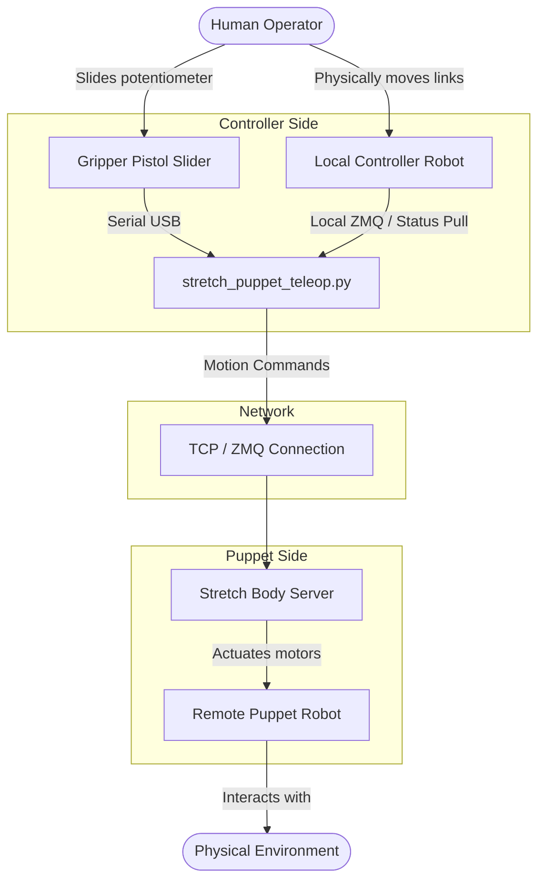

# Stretch Puppet Teleop Primer

The `stretch_puppet_teleop.py` tool allows a user to control a remote Stretch robot (the "Puppet") by physically moving the joints of a local Stretch robot (the "Controller"). 

## 1. Overview and Architecture

When the script is launched, it connects to the local Controller robot and places its joints (lift, arm, wrist, base) into a backdrivable "freewheel" or "safety" mode. This allows a human operator to physically push and pull the robot's links. The script continuously reads the joint positions of the Controller at a high frequency (80 Hz) and streams them as motion commands to the remote Puppet robot over the network.

Additionally, the Controller tool supports a custom "Pistol Grip" hardware attachment (`/dev/hello-gripper-pistol`) with a slider potentiometer. This slider can be used to control the Puppet's gripper aperture, independent of the Controller's physical gripper state.

### Architecture Block Diagram


## 2. Controller Robot Setup
* 2 Stretch
* 1 controller Stretch with pistol gripper, and gripper mapped to /dev/hello-gripper-pistol
* 2nd Stretch with SG4 or PG4 tool

Add the following to `/etc/udev/rules.d/95-hello-arduino.rules`
`KERNEL=="ttyACM*", ATTRS{idVendor}=="239a", ATTRS{idProduct}=="8101",MODE:="0666",  SYMLINK+="hello-gripper-pistol", ENV{ID_MM_DEVICE_IGNORE}="1"`

Then run `sudo udevadm control --reload` and confirm that /dev/hello-gripper-pistol is there
## 2. Networking Setup

To successfully teleoperate the Puppet robot, both robots must be connected to the same network (e.g., the same Wi-Fi router or a direct Ethernet connection), and you must know the IP address of the Puppet robot.

**Step 1: Find the Puppet's IP Address**
On the remote Puppet robot, open a terminal and run:
```bash
hostname -I
```
Alternatively, you can use `ip a` or `ifconfig`. Note the IPv4 address (e.g., `192.168.1.15`).

**Step 2: Start the Robot Servers**
Both robots require the Stretch Body Server to be running.
*   **On the Puppet robot:** Start the server in a terminal:
    ```bash
    stretch_body_server
    ```
*   **On the Controller robot:** Start the server in a terminal:
    ```bash
    stretch_body_server
    ```

**Step 3: Run the Teleop Script**
On the Controller robot, run the teleop script and provide the Puppet's IP address (see Usage Examples below).

## 3. Command Line Arguments

The `stretch_puppet_teleop.py` script provides several arguments to customize the teleoperation experience:

| Argument | Description |
| :--- | :--- |
| `--puppet_ip` | IP address of the remote Puppet robot running Stretch Body Server (e.g., `192.168.1.10`). Required unless `--no_puppet` is set. |
| `--joints` | List of joints to mimic. Default is: `omnibase lift arm wrist gripper`. Example: `--joints lift arm` |
| `--no_puppet` | Runs the script in a local-only testing mode without connecting to a puppet robot. Useful for verifying the controller's backdrivability and joint sensors. |
| `--no_pistol` | Runs the script without attempting to connect to the pistol grip slider hardware. |
| `--pg4` | Indicates that the Puppet robot is equipped with a Parallel Gripper 4. Automatically maps standard gripper slider inputs to PG4 translation commands. |
| `--pg4c` | Indicates that the Controller robot is equipped with a Parallel Gripper 4. |
| `--print_only` | Connects to both robots and prints their joint positions to the terminal, but does *not* command any motion on the Puppet. Good for safe network testing. |

> [!IMPORTANT]
> The wrist_pitch, wrist_yaw, and wrist_roll joints on the Controller robot must have `enable_torque_after_runstop: 0` configured in their `stretch_user_params.yaml`. This ensures the wrist remains backdrivable and doesn't snap to a position after a runstop event.

## 4. Usage Examples

Here are common ways to launch the teleoperation script. For these examples, we assume the Puppet robot's IP address is `192.168.1.15`.

**Standard Teleoperation**
Connects to the puppet and starts mimicking all default joints, assuming the pistol grip slider is attached.
```bash
stretch_puppet_teleop.py --puppet_ip 192.168.1.15
```

**Teleoperation Without Pistol Grip**
If you are using a standard Controller robot without the custom pistol grip hardware installed.
```bash
stretch_puppet_teleop.py --puppet_ip 192.168.1.15 --no_pistol
```

**Teleoperation with a Parallel Gripper (PG4)**
If the remote Puppet robot has the Parallel Gripper 4 attached instead of the standard Stretch Gripper.
```bash
stretch_puppet_teleop.py --puppet_ip 192.168.1.15 --pg4
```

**Partial Teleoperation (Arm and Lift Only)**
Only mirror the lift and arm extensions. The base, wrist, and gripper will remain stationary.
```bash
stretch_puppet_teleop.py --puppet_ip 192.168.1.15 --joints lift arm --no_pistol
```

**Safe Dry-Run**
Connects to the Puppet over the network and displays the real-time joint positions of both robots in a terminal table, without actually moving the Puppet.
```bash
stretch_puppet_teleop.py --puppet_ip 192.168.1.15 --print_only
```

**Controller Hardware Test**
Places the local Controller robot into backdrivable mode and prints joint values to the terminal. No network connection or Puppet robot is required.
```bash
stretch_puppet_teleop.py --no_puppet
```

**Base Rotation Only**
Filters out translation commands from the Controller's base. Pushing the Controller base will only generate pure rotation commands on the Puppet.
```bash
stretch_puppet_teleop.py --puppet_ip 192.168.1.15 --base_rotate_only
```
