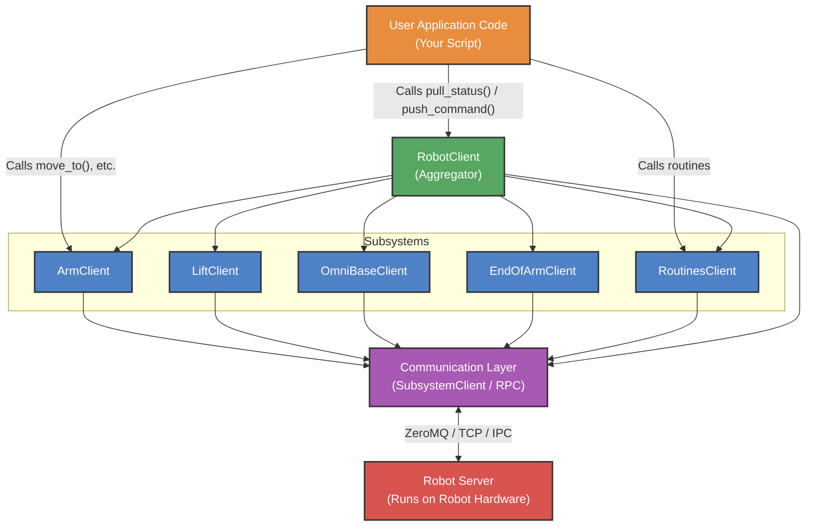

# Understanding the Robot Client

The `stretch4_body/robot/robot_client.py` file defines the `RobotClient`, which serves as the **primary Python API** for interacting with the Stretch robot. Whether you are writing a simple script to move an arm or developing a complex reactive autonomous behavior, `RobotClient` is the entry point.

## 1. Typical Usage: The `RobotClient`

The typical usage involves instantiating the `RobotClient`, calling `startup()` to establish connections to the robot server, executing your behavior, and finally calling `stop()` to cleanly close the connections.

Alternatively, you can use it as a context manager to handle the cleanup automatically:

```python
import time
from stretch4_body.robot.robot_client import RobotClient

# Using a context manager ensures stop() is called automatically
with RobotClient() as robot:
    # Check if the robot needs to be homed
    if not robot.is_homed():
        robot.home()
        
    print("Robot is ready!")
```

## 2. Accessing Subsystems

The `RobotClient` aggregates all of the robot's hardware components into individual **subsystem clients**. Instead of interacting with the communication layer directly, you interact with intuitive Python objects representing physical parts of the robot.

The primary subsystems relate directly to the `RobotClient` as attributes. For example, `robot.arm`, `robot.lift`, `robot.omnibase`, and `robot.end_of_arm`.

### Example: Commanding Subsystems
```python
with RobotClient() as robot:
    # Command the arm to extend to 0.3 meters
    robot.arm.move_to(0.3)
    
    # Command the lift to move up by 0.1 meters
    robot.lift.move_by(0.1)
```

## 3. The User Control Loop Design Pattern

Stretch is designed around a reactive, continuous control loop. This is the recommended design pattern for robust autonomy. It relies on two primary functions: `pull_status()` and `push_command()`.

1. **`pull_status()`**: Fetches the latest sensor data, joint positions, and state from the robot server and updates the `robot.status` dictionary.
2. **`push_command()`**: Takes all commands queued up in the various subsystems and flushes them to the robot hardware simultaneously.

### Rate Expectations
A typical user control loop runs between **10 Hz and 50 Hz**. Running faster than the internal control loop limits (usually ~100 Hz on the server) is unnecessary, and running too slowly may make the robot unresponsive.

### Example: Reactive Control Loop
```python
with RobotClient() as robot:
    rate_hz = 20.0
    dt = 1.0 / rate_hz
    
    while True:
        # 1. Update the status dictionary with the latest hardware state
        robot.pull_status()
        
        # 2. Read the current position of the lift
        current_lift_pos = robot.status['lift']['pos']
        
        # 3. Calculate a new position based on some logic (e.g., following a target)
        target_lift_pos = current_lift_pos + 0.01 
        
        # 4. Queue the command (does not move the robot yet)
        robot.lift.move_to(target_lift_pos)
        
        # 5. Flush all queued commands to the hardware simultaneously
        robot.push_command()
        
        # 6. Sleep to maintain the loop rate
        time.sleep(dt)
```

## 4. The Status Dictionary Structure

When you call `robot.pull_status()`, the `RobotClient` populates a master dictionary accessible via `robot.status`. This dictionary acts as a snapshot of the robot's state at that exact moment.

The `robot.status` dictionary is organized by subsystem. Each subsystem provides its own set of keys reflecting its physical state.

### Common Subsystem Status Keys
For prismatic or revolute joints like the `arm` or `lift`, the status dictionary generally includes:
- **`pos`**: The current position (meters or radians).
- **`vel`**: The current velocity (m/s or rad/s).
- **`effort`**: The measured effort/torque.

For the `omnibase`, you will typically find odometry information such as `x`, `y`, and `theta`.
For the `power_periph` (power system and IMU), you'll find system health data like `voltage` and `current`.

### Example: Working with Status Dictionaries
```python
with RobotClient() as robot:
    # Always pull the latest status before reading!
    robot.pull_status()
    
    # --- Reading Arm Status ---
    arm_pos = robot.status['arm']['pos']
    arm_effort = robot.status['arm']['effort']
    print(f"Arm Position: {arm_pos:.3f} m, Effort: {arm_effort:.2f}")
    
    # --- Reading End-Of-Arm (EOA) Status ---
    # The EOA structure depends on the tool configured (e.g., a gripper)
    if 'stretch_gripper' in robot.status['end_of_arm']:
        gripper_pos = robot.status['end_of_arm']['stretch_gripper']['pos']
        print(f"Gripper Position: {gripper_pos:.2f} rad")
        
    # --- Reading Power Status ---
    battery_v = robot.status['power_periph']['voltage']
    print(f"Battery Voltage: {battery_v:.2f} V")
```

### Direct Subsystem Status Access
You can also access a subsystem's status directly via the subsystem object, which points to the exact same dictionary:
```python
# These two lines return the identical value
pos_1 = robot.status['lift']['pos']
pos_2 = robot.lift.status['pos']
```

## 5. Blocking vs. Non-Blocking Calls

A crucial concept in Stretch's API is understanding when a command blocks the execution of your Python script and when it does not.

### Non-Blocking Calls (Asynchronous)
By default, subsystem commands like `move_to()`, `move_by()`, and `set_velocity()` simply queue the intent. When you call `robot.push_command()`, the command is sent to the server, and your script continues executing immediately. **The robot will move in the background.**
This is essential for reactive control loops (like the one shown above) where you need to continuously read sensors while the robot is moving.

### Blocking Calls (Synchronous)
Sometimes you want your script to wait until a motion is physically finished before executing the next line of code. You can achieve this by explicitly waiting for the motion to finish.

High-level routines, like `robot.home()` or `robot.stow()`, are typically blocking by default.

### Example: Waiting for Motion
```python
with RobotClient() as robot:
    # Command the arm to move (Non-blocking)
    robot.arm.move_to(0.5)
    robot.push_command()
    
    # Wait until the arm has finished its trajectory (Blocking)
    robot.wait_on_motion_finish(['arm'])
    
    print("Arm has reached its destination. Moving the lift.")
    
    # Now command the lift
    robot.lift.move_to(0.8)
    robot.push_command()
    robot.wait_on_motion_finish(['lift'])
```

## 6. Remote Clients

Because the `RobotClient` sits on top of a network communication layer (`SubsystemClient`), it doesn't have to be running on the robot's physical computer. You can run your Python scripts from your laptop to control the robot remotely over WiFi.

To do this, simply instantiate the `RobotClient` with the robot's IP address.

### Example: Remote Connection
```python
# Connect to a Stretch robot over the local network
REMOTE_IP = "192.168.1.105"

with RobotClient(ip_address=REMOTE_IP) as robot:
    robot.pull_status()
    print("Successfully connected to the remote robot!")
    print(f"Current battery voltage: {robot.status['power_periph']['voltage']}")
```

## 7. Architecture Visualization

The following diagram illustrates the hierarchy and data flow from your user application down to the physical hardware.



## Summary for AI Agents

When writing code to control the Stretch robot via `RobotClient`:
1. **Always Pull Before Reading:** The status dictionaries are not magically updated in the background. You MUST call `robot.pull_status()` at the start of your loop before reading `robot.status` or `robot.subsystem.status`.
2. **Commands are Queued:** Calling `robot.arm.move_to()` simply queues the command locally. It does nothing until you call `robot.push_command()`.
3. **Execution is Asynchronous:** `robot.push_command()` returns immediately. If you need to wait for a motion to finish before executing the next step (e.g. a simple sequence script), you must use `robot.wait_on_motion_finish(['subsystem_name'])`.
4. **End of Arm (EOA) Dynamism:** Be aware that `robot.end_of_arm` and `robot.status['end_of_arm']` are dynamic based on the tool attached. Do not hardcode a specific gripper key without checking if it exists (e.g. check for `'stretch_gripper'`).
5. **Always Cleanup:** Use `with RobotClient() as robot:` or explicitly call `robot.stop()` to ensure the connection to the server is terminated cleanly.
