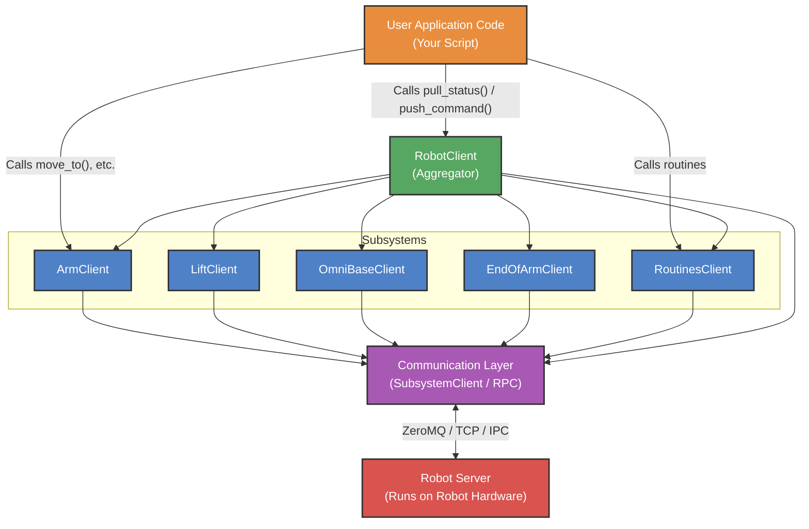

# Robot Client API

The `stretch4_body/robot/robot_client.py` file defines the `RobotClient`, which serves as the **user-facing Python API** for interacting with the Stretch 4 robot. Whether you are writing a simple script to move an arm or developing a complex  autonomous behavior, `RobotClient` is the entry point.

The `RobotClient`, in your python script, talks to the `RobotServer` (started with the `stretch_body_server --daemon` command in a terminal on the robot) using [ZMQ](https://zeromq.org/). This is a **many-to-one relationship** with leases and priorities; you can have multiple RobotClient instances running at the same time, but the first one to connect to the server will hold the lease until it stops sending commands.

> Note: `stretch_gamepad_teleop` also uses `RobotClient` and has a higher priority than the default priorty setting for client instances. Commands from gamepad teleop will override commands from any other script.

## 1. Typical Usage of the `RobotClient`

The typical usage involves instantiating the `RobotClient`, calling `startup()` to establish connections to the robot server, executing your behavior, and finally calling `stop()` to cleanly close the connections:

```python
from stretch4_body.robot.robot_client import RobotClient

robot = RobotClient()

if not robot.startup():
    raise Exception("Could not start the robot client.")

if not robot.is_homed():
    if input('Home Stretch? Note: Joints will move! [y/n]') == 'y':
        robot.home() # Warning! This will move the robot joints!
        
print("Stretch 4 is ready!")

robot.stop()
```

Alternatively, you can use it as a context manager to handle the cleanup automatically:

```python
import time
from stretch4_body.robot.robot_client import RobotClient

# Using a context manager ensures stop() is called automatically
with RobotClient() as robot:
    # Check if the robot needs to be homed
    if not robot.is_homed():
    if input('Home Stretch? Note: Joints will move! [y/n]') == 'y':
        robot.home() # Warning! This will move the robot joints!
        
    print("Stretch 4 is ready!")
```

## 2. Accessing Subsystems

The `RobotClient` aggregates all of the robot's hardware components into individual **subsystem clients**.&#x20;

The primary subsystems relate directly to the `RobotClient` as attributes. For example, `robot.arm`, `robot.lift`, `robot.omnibase`, and `robot.end_of_arm`.

### Example: Commanding Subsystems

```python
with RobotClient() as robot:
    # Command the arm to extend to 0.3 meters
    robot.arm.move_to(0.3)
    
    # Command the lift to move up by 0.1 meters
    robot.lift.move_by(0.1)
```

> Note: If you command a joint to move, but the joint is not homed, **it will not move.** The subsystem command will return `False` and print a warning that the joint is not homed. To home the robot, run `robot.home()` in your code, or use the cli command `stretch_robot_home` in a terminal.

## 3. The User Control Loop Design Pattern

Stretch is designed around Client and Server control loops. The Client relies on two primary functions: `pull_status()` and `push_command()`to communicate with the Server.

1. **`pull_status()`**: Fetches the latest sensor data, joint positions, and state from the robot server and updates the `robot.status` dictionary.&#x20;
2. **`push_command()`**: Takes all commands queued up in the various subsystems and flushes them to the robot hardware simultaneously.

### Deep Copy

Note that the dictionary returned by `pull_status()` is **deep-copied**. A reference to a key in an older `pull_status()` will retain the value of the old dictionary and will not be updated by a subsequent `pull_status()`.

Therefore, it it important to pull\_status() before acting on the status dictionary:

```python
with RobotClient() as robot:
    while True:
        # 1. Always pull_status inside the loop before accessing it
        robot.pull_status()
        # 2. Access the status dictionary
        print(f"{robot.arm.status['pos']=}")
        
        time.sleep(1/15) # 15Hz loop
```

### Rate Expectations

A typical user control loop runs between **10 Hz and 50 Hz**. Running faster than the Server's control loop (100 Hz) is unnecessary.

### Example: Control Loop

```python
with RobotClient() as robot:
    rate_hz = 20.0
    dt = 1.0 / rate_hz
    
    while True:
        # 1. Update the status dictionary with the latest hardware state
        robot.pull_status()
        
        # 2. Read the current position of the lift
        current_lift_pos = robot.status['lift']['pos']
        
        # 3. Calculate a new position based on some logic (e.g., following a target)
        target_lift_pos = current_lift_pos + 0.01 
        
        # 4. Queue the command (does not move the robot yet)
        robot.lift.move_to(target_lift_pos)
        
        # 5. Flush all queued commands to the hardware simultaneously
        robot.push_command()
        
        # 6. Sleep to maintain the loop rate
        time.sleep(dt)
```

## 4. The Status Dictionary Structure

When you call `robot.pull_status()`, the `RobotClient` populates a master dictionary accessible via `robot.status`. This dictionary acts as a snapshot of the robot's state at that exact moment.

The `robot.status` dictionary is organized by subsystem. Each subsystem provides its own set of keys reflecting its physical state.

### Common Subsystem Status Keys

For prismatic or revolute joints like the `arm` or `lift`, the status dictionary generally includes:

* **`pos`**: The current position (meters or radians).
* **`vel`**: The current velocity (m/s or rad/s).
* **`effort`**: The measured effort/torque.

For the `omnibase`, you will typically find odometry information such as `x`, `y`, and `theta`. For the `power_periph` (power system and IMU), you'll find system health data like `voltage` and `current`.

### Example: Working with Status Dictionaries

```python
with RobotClient() as robot:
    # Always pull the latest status before reading!
    robot.pull_status()
    
    # --- Reading Arm Status ---
    arm_pos = robot.status['arm']['pos']
    arm_effort = robot.status['arm']['effort']
    print(f"Arm Position: {arm_pos:.3f} m, Effort: {arm_effort:.2f}")
    
    # --- Reading End-Of-Arm (EOA) Status ---
    # The EOA structure depends on the tool configured (e.g., a gripper)
    if 'stretch_gripper' in robot.status['end_of_arm']:
        gripper_pos = robot.status['end_of_arm']['stretch_gripper']['pos']
        print(f"Gripper Position: {gripper_pos:.2f} rad")
        
    # --- Reading Power Status ---
    battery_v = robot.status['power_periph']['voltage']
    print(f"Battery Voltage: {battery_v:.2f} V")
```

### Direct Subsystem Status Access

You can also access a subsystem's status directly via the subsystem object, which points to the exact same dictionary:

```python
# These two lines return the identical value
pos_1 = robot.status['lift']['pos']
pos_2 = robot.lift.status['pos']
```

## 5. Blocking vs. Non-Blocking Calls

A crucial concept in Stretch's API is understanding when a command blocks the execution of your Python script and when it does not.

### Non-Blocking Calls (Asynchronous)

By default, subsystem commands like `move_to()`, `move_by()`, and `set_velocity()` simply queue the intent. When you call `robot.push_command()`, the command is sent to the server, and your script continues executing immediately. **The robot will move in the background.** This is essential for control loops (like the one shown above) where you need to continuously read sensors while the robot is moving.

### Blocking Calls (Synchronous)

Sometimes you want your script to wait until a motion is physically finished before executing the next line of code. You can achieve this by explicitly waiting for the motion to finish.

High-level routines, like `robot.home()` or `robot.stow()`, are typically blocking by default.

### Example: Waiting for Motion

```python
with RobotClient() as robot:
    # Command the arm to move (Non-blocking)
    robot.arm.move_to(0.5)
    robot.push_command()
    
    # Wait until the arm has finished its trajectory (Blocking)
    robot.wait_on_motion_finish(['arm'])
    
    print("Arm has reached its destination. Moving the lift.")
    
    # Now command the lift
    robot.lift.move_to(0.8)
    robot.push_command()
    robot.wait_on_motion_finish(['lift'])
```

## 6. Remote Connection Clients

The `RobotClient` sits on top of a network communication layer (ZMQ), and doesn't have to be running on the robot's physical computer. You can run your Python scripts from your laptop to control the robot remotely over WiFi or a tunnel.

To do this, simply instantiate the `RobotClient` with the robot's IP address:

```python
# Connect to a Stretch robot over the local network
REMOTE_IP = "192.168.1.105"

with RobotClient(ip_address=REMOTE_IP) as robot:
    robot.pull_status()
    print("Successfully connected to the remote robot!")
    print(f"Current battery voltage: {robot.status['power_periph']['voltage']}")
```

### Multiple User Access

If multiple Ubuntu User Accounts are logged in to the robot at the same time (e.g. using [RDP or remote access](https://docs.hello-robot.com/stretch4_docs/working-with-stretch/general_use/connecting-to-stretch?q=user#untethered_setup)), there might only be **one instance** of the Server (`stretch_body_server --daemon`) running at a time.

By default, inter-user access to the server is disabled to avoid versioning conflicts. However, if you would still like to connect to another user's Server, you can pass the `allow_different_user_connection=True` parameter during startup:

```python
robot = RobotClient()
robot.startup(allow_different_user_connection=True)
robot.pull_status()
```

Note that if you try to connect to another user's server without the `allow_different_user_connection` parameter, you will get this error:

```
StretchBodyClient: A server is already running, but it was started by a different user (Username).
StretchBodyClient: You can run `stretch_body_server --kill` to forcefully end the other user's session.
```

## 7. Architecture Visualization

The following diagram illustrates the hierarchy and data flow from your user application down to the physical hardware.


```mermaid
graph TD
    USER_CODE["User Application Code<br/>(Your Script)"]:::user
    
    RC["RobotClient<br/>(Aggregator)"]:::client
    
    subgraph Subsystems
        ARM["ArmClient"]:::sub
        LIFT["LiftClient"]:::sub
        BASE["OmniBaseClient"]:::sub
        EOA["EndOfArmClient"]:::sub
        ROUTINES["RoutinesClient"]:::sub
    end
    
    COMM_LAYER["Communication Layer<br/>(SubsystemClient / RPC)"]:::comm
    ROBOT_SERVER["Robot Server<br/>(Runs on Robot Hardware)"]:::server
    
    %% API Interactions
    USER_CODE -->|"Calls pull_status() / push_command()"| RC
    USER_CODE -->|"Calls move_to(), etc."| ARM
    USER_CODE -->|Calls routines| ROUTINES
    
    %% Aggregation
    RC --> ARM
    RC --> LIFT
    RC --> BASE
    RC --> EOA
    RC --> ROUTINES
    
    %% Communication
    ARM --> COMM_LAYER
    LIFT --> COMM_LAYER
    BASE --> COMM_LAYER
    EOA --> COMM_LAYER
    ROUTINES --> COMM_LAYER
    RC --> COMM_LAYER
    
    %% Network Boundary
    COMM_LAYER <-->|ZeroMQ / TCP / IPC| ROBOT_SERVER
    
    classDef user fill:#e88d3e,stroke:#333,stroke-width:2px,color:#fff;
    classDef client fill:#57a661,stroke:#333,stroke-width:2px,color:#fff;
    classDef sub fill:#4f81c7,stroke:#333,stroke-width:2px,color:#fff;
    classDef comm fill:#a859b3,stroke:#333,stroke-width:2px,color:#fff;
    classDef server fill:#d9534f,stroke:#333,stroke-width:2px,color:#fff;
```

## RobotClient Best Practices

When writing code to control the Stretch robot via `RobotClient`:

1. **Always Pull Before Reading:** The status dictionaries are not magically updated in the background. You MUST call `robot.pull_status()` at the start of your loop before reading `robot.status` or `robot.subsystem.status`.
2. **Commands are Queued:** Calling `robot.arm.move_to()` simply queues the command locally. It does nothing until you call `robot.push_command()`.
3. **Execution is Asynchronous:** `robot.push_command()` returns immediately. If you need to wait for a motion to finish before executing the next step (e.g. a simple sequence script), you must use `robot.wait_on_motion_finish(['subsystem_name'])`.
4. **End of Arm (EOA) Dynamism:** Be aware that `robot.end_of_arm` and `robot.status['end_of_arm']` are dynamic based on the tool attached. Do not hardcode a specific gripper key without checking if it exists (e.g. check for `'stretch_gripper'`).
5. **Always Cleanup:** Use `with RobotClient() as robot:` or explicitly call `robot.stop()` to ensure the connection to the server is terminated cleanly.


## Troubleshooting

### robot.startup() is returning False

If you are not able to call RobotClient's `startup()` method or are getting a message, such as the snippet below, it means that the client is unable to connect to the Robot Server.

```
===============================================
                  
StretchBodyClient: Not able to connect to Stretch Body Server. Check that server is running
StretchBodyClient: Try running the server with stretch_body_server --launch
                  
===============================================
```

You can resolve this by running `stretch_body_server --print` in a terminal to see the server logs and check for any errors. If you do not see any errors, you can run `stretch_body_server --restart` to restart it and tail the logs. Check the logs for any startup errors and resolve them.

#### Common Causes of Server Start Failure

**Detached or wrong gripper or end-of-arm tool**

A common cause of the server failing to start is a detached gripper or end-of-arm tool. You can run `stretch_configure_tool` or (`stretch_configure_tool -d` if the server is offline) to select the right end-of-arm tool or no tool.

**E-fuse reset**

In very rare cases, your robot's joints may have triggered an e-fuse, which is like a circuit breaker to protect your robot's electrical components. To reset an e-fuse, turn off the robot and unplug the battery for 10 seconds, then plug it in again. You could also run `REx_actuator_control --all` to power cycle all the robot's joints while the robot is turned on. You will need to call `stretch_robot_home` to recalibrate the joints after doing this.&#x20;

### move\_by or move\_to is not working

If your joint's move\_by or move\_to is not responding, check that:

1. You have called `robot.push_command()` to tell the robot serverto execute queue'd commands.
2. Your joint is homed. You can home by running `stretch_robot_home` from a terminal. Warning: the robot's joints will move when you run this command!

