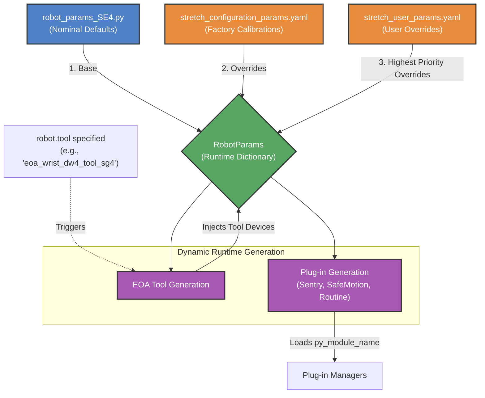

# Understanding Stretch Robot Parameters

This document provides a comprehensive overview of the parameter system in the Stretch robot codebase, including its organizational structure, runtime plug-in mechanisms, and the tools available for managing parameters. It is designed to be easily accessible to both users and AI agents.

## 1. High-Level Organizational Structure

The parameter system in Stretch uses a multi-layered dictionary approach, prioritized from base defaults to user-specific overrides. Parameters are resolved dynamically at runtime by `stretch4_body.core.robot_params.RobotParams`. 

The parameter dictionaries are loaded and overwritten in the following order (ascending priority):

1. **`robot_params_<MODEL>.py` (Python):** Model-specific nominal parameters (e.g., `robot_params_SE4.py`). Defines the baseline configuration for a specific robot model.
2. **`stretch_configuration_params.yaml` (YAML):** Robot-specific data (e.g., serial numbers, hardware offsets, and factory calibration data). Typically updated by factory or calibration tools.
3. **`stretch_user_params.yaml` (YAML):** User-specific overrides (e.g., custom velocity limits, contact thresholds, controller tunings). **This is the highest priority.**

> [!WARNING]
> **Common Trap:** A frequent issue is that a robot may have `user_params` overriding the factory params (perhaps set by another user previously), generating undesired or unexpected behavior. Always check `stretch_user_params.yaml` for active user overrides if the robot behaves unexpectedly.

> [!NOTE]
> **YAML vs. Python:** Python files serve as the rigid, heavily-structured "default" settings shipped by the manufacturer. YAML files act as local configuration files used to store specific calibrations (`configuration_params.yaml`) or explicit user preferences (`user_params.yaml`) without modifying the tracked source code.

### Plug-in System and Runtime Generation

Stretch utilizes a highly modular plug-in architecture to dynamically generate configurations at runtime based on the physical hardware attached to the robot.

* **Plug-in Managers (`SentryManager`, `SafeMotionManager`, `RoutineManager`):** The system uses various managers to dynamically load plug-ins. 
  * `SentryManager` handles safety sentries or monitors (e.g., `self_collision_loop`) that protect the robot or monitor state. 
  * `SafeMotionManager` manages plug-ins that restrict motions of the motors to help avoid hazards (e.g., limiting velocity/acceleration, triggering safe stops).
  * `RoutineManager` manages plug-ins that execute complex routines or behaviors.
  These plug-ins are defined in the parameters under `['controllers']`. At runtime, the respective manager reads the `py_module_name` and `py_class_name` for each enabled plug-in and instantiates them dynamically.
* **End-Of-Arm (EOA) Tool Generation:** The End-Of-Arm tool configuration is entirely generated at runtime. When `robot.tool` is specified in a YAML file (e.g., `'eoa_wrist_dw4_tool_sg4'`), the `RobotParams` class looks up the corresponding tool template in `nominal_params`. It expands the parameter dictionary by pulling in the relevant joint properties (like `SE4_wrist_yaw_DW4` or `SE4_stretch_gripper_DW4`) into the active `devices` list.

## 2. Managing Parameters with CLI Tools

The codebase provides two primary Python scripts to inspect and modify parameters:

### `stretch_params.py`
This tool recursively traverses the resolved parameter tree and prints it to the console, importantly noting the **Origin** of each parameter (e.g., whether it came from nominal python defaults, or was overridden by `stretch_user_params.yaml`).

**Using with `grep`:** Since the parameter list is extensive, `stretch_params.py` is best used alongside `grep` to quickly check the active value of a specific parameter and ensure user overrides are being respected.

```bash
# Check the active value and origin of the arm's velocity
stretch_params.py | grep arm | grep vel_m
```

### `stretch_change_param.py`
An interactive command-line utility used to safely modify the robot parameters. It dynamically explores the `RobotParams` tree. When a user modifies a value, the script automatically writes the override to `stretch_user_params.yaml` without destroying existing overrides in the file.

```bash
# Launch the interactive parameter modification tool
stretch_change_param.py
```

## 3. Detailed Parameter Sections in `robot_params_SE4.py`

The `robot_params_SE4.py` file contains the baseline configuration for the Stretch SE4 model. It is organized into several distinct logical blocks:

### 3.1. EOA Joint Templates
Variables like `SE4_wrist_yaw_DW4` and `SE4_stretch_gripper_DW4` define the physical attributes of individual dynamixel/feetech servos. 
* **Details:** Contains `eeprom_cfg` (limits, PIDs, protections) and `motion` profiles (`default`, `fast`, `max`, `slow`).
* **Relation to Structure:** These serve as building blocks. They are not directly loaded into the root parameter dictionary until an EOA tool explicitly requests them.

### 3.2. EndOfArm Defn (Tool Configurations)
Dictionaries like `SE4_eoa_wrist_dw4_tool_sg4` group multiple EOA joints together into a cohesive tool.
* **Details:** Defines the `wrist`, the `tool`, `stow` positions, collision management offsets, and points to the `py_class_name` and `py_module_name` for the software driver. It also enumerates the required joint templates under the `devices` key.
* **Relation to Structure:** This represents the plug-in schema. When a tool is selected, `RobotParams` iterates through the `devices` key and merges the associated EOA Joint Templates (from 3.1) into the active parameter tree.

### 3.3. `nominal_params` (Root Dictionary)
This is the master dictionary that gets injected into `RobotParams`. It contains base configurations for major subsystems and managers:
* **Hardware Subsystems:** Configurations for hardware like `omnibase` (kinematics, wheel diameter), `arm` (gearing, homing thresholds), and generic motor templates (e.g., `hello-motor-omni-2` or stepper motors).
* **Loops and Rates:** Settings for control loops like `line_sensor_loop` and `end_of_arm_loop` (e.g., `loop_rate_Hz`).
* **Plug-in Configurations:** Defines the parameter profiles for the various plug-ins managed by `SentryManager`, `SafeMotionManager`, and `RoutineManager` (e.g., settings for `routine_docking` or `sentry_self_collision`).
* **Relation to Structure:** It acts as the baseline priority hierarchy. It holds the `supported_eoa` lists and templates that the runtime generation system uses to build the final dictionary.

## 4. Organizational Structure Visualization

The following diagram illustrates how parameters flow into the resolved parameter tree and how plug-ins are generated.



## Summary for AI Agents

When interacting with the Stretch parameter system:
1. **Never edit `robot_params_SE4.py` to change a local behavior.** Always instruct the user to use `stretch_change_param.py` or modify `stretch_user_params.yaml`.
2. **Dynamic Resolution:** Be aware that the dictionary structure changes based on the configured tool. If a joint isn't physically attached (defined by `robot.tool`), its parameters will not exist in the resolved tree.
3. **Debugging:** Use `stretch_params.py` to trace where a parameter is coming from if you suspect a YAML file isn't applying correctly.
