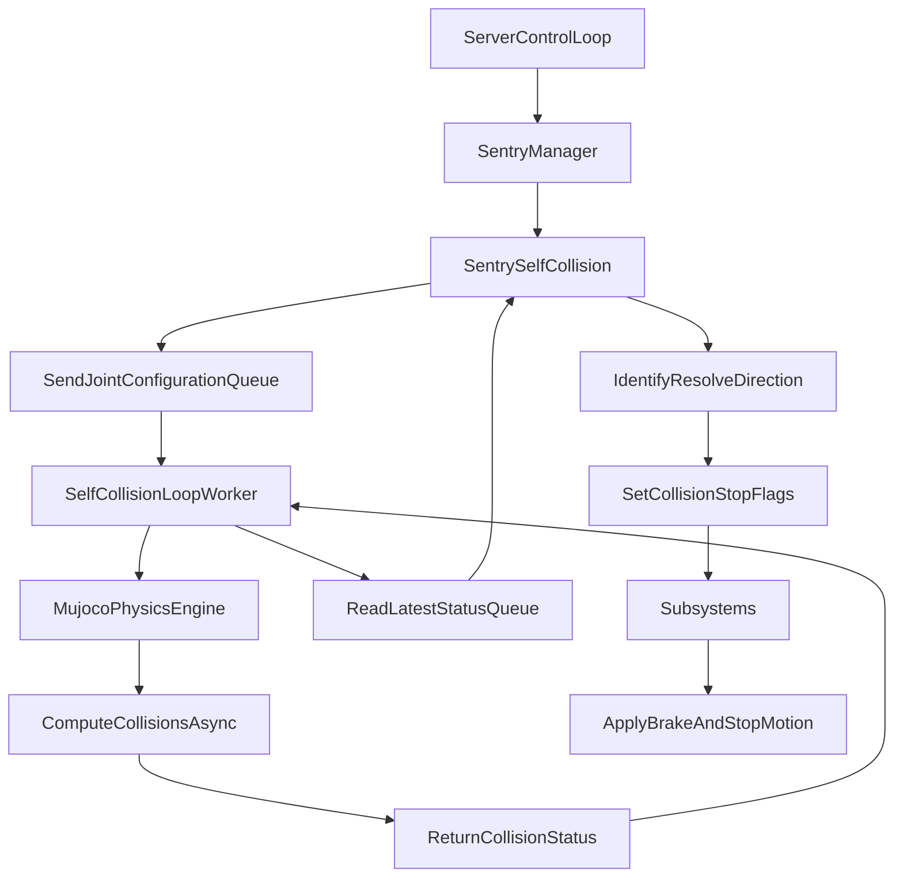

# Self-Collision System Primer

The self-collision system is a critical safety behavior implemented as a Sentry (`SentrySelfCollision`). It continuously monitors the robot's joint states to prevent the arm, lift, and end-of-arm tools from colliding with the robot's own body (e.g., the mast, base, or head).

## 1. High-Level Architecture

The self-collision system is organized into several distinct layers:

*   **MuJoCo Physics Engine:** At the core, the system uses the MuJoCo physics engine to perform fast forward kinematics and collision checking. It dynamically loads the robot's exact URDF and collision meshes using the `stretch4_urdf` package, matching the specific robot model, batch, and attached end-of-arm tool.
*   **Multiprocessing (`SelfCollisionLoop`):** Collision checking is computationally intensive. To prevent it from blocking the high-frequency (100Hz) main control loop, the `SelfCollisionLoop` spawns a dedicated background worker process. The main server loop sends the current joint configuration into an asynchronous command queue, and the background worker continuously processes these states, pushing the resulting collision status back into a status queue.
*   **Motion Clipping Response:** When a collision is imminent, MuJoCo calculates the "collision direction"—the gradient indicating which way the joint must move to escape the collision. The `SentrySelfCollision` uses this to set `pos` or `neg` collision flags for the affected joints. These flags are fed into each subsystem's `step_collision_avoidance` method (e.g., in the `Arm` or `Lift` classes), which actively zeroes out any commanded velocity that would push the joint further into the collision, stopping the joint while allowing the user to back away safely.

## 2. Configuration Parameters

The system is highly configurable via the `self_collision_mujoco` dictionary in the robot's parameter files (e.g., `stretch4_body/robot/robot_params_SE4.py`). These parameters dictate what is checked and how sensitive the system is:

*   **`k_brake_distance`:** The system doesn't just check the robot's exact current position; it checks a "virtual" position slightly ahead of the robot based on its current velocity and braking capabilities. The `k_brake_distance` parameter (e.g., `{'lift': 1.1, 'arm': 1.1}`) acts as a multiplier. A value of 1.1 means the system pads the joint's position by 110% of its required braking distance, ensuring the robot stops *before* making contact.
*   **`ignore_links`:** A list of URDF link names (e.g., `wheel_0_link`, `camera_center_link`) that will be completely ignored by the collision engine. Their collision properties are disabled internally to save computation time and ignore benign hardware.
*   **`exclusions`:** A list of link pairs (e.g., `["head_link", "lift_link"]`). These specific pairs are allowed to intersect or touch without triggering a collision event. This is necessary because many adjacent links in a URDF naturally overlap at their joints during normal operation.

## 3. Flow of Control

The following diagram illustrates how data flows through the system, from the main control loop down to the physics engine, and back up to stop the joint motion.

