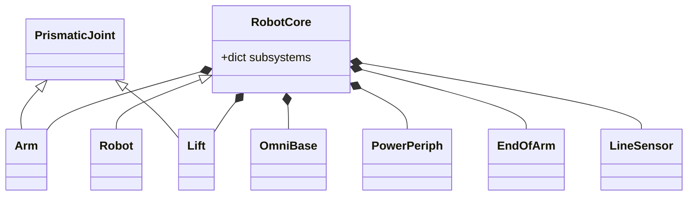

# Stretch Subsystems Primer

This document provides an overview of the core hardware subsystems that make up the Stretch robot. It details how these subsystems are instantiated, managed, and configured, along with key parameters, status fields, and API calls for each.

## Subsystem Instantiation and Management

Subsystems are managed collectively by the `RobotCore` base class (and its descendants, like `Robot` or the `RobotServer`). During startup, `RobotCore` reads the `subsystems` list from the active parameter configuration (`robot_params`). It then instantiates the corresponding Python objects and stores them in its `self.subsystems` dictionary.

*   `RobotCore` handles the base instantiation of `arm`, `lift`, `omnibase`, and `power_periph`.
*   The `end_of_arm` and `line_sensor` subsystems are handled specifically by `Robot` or the server, as they rely on additional configuration (such as `robot.tool` to determine the active class) or separate multiprocess workers.

During the control loop, `RobotCore` aggregates data by calling `pull_status` and `push_command` on every active subsystem in the list.

### Disabling a Subsystem

If a hardware subsystem is physically removed or malfunctioning, you can prevent the software from attempting to instantiate and communicate with it by overriding the `subsystems` list in your `stretch_user_yaml`. 

For example, to run the robot without the `end_of_arm` subsystem, you would add the following to your user YAML:

```yaml
robot:
  subsystems:
    - arm
    - lift
    - omnibase
    - power_periph
```
*(By omitting `end_of_arm`, the software will bypass its initialization entirely.)*

> **Note on Cameras:** The `cameras` directory is included within the `subsystems` folder structure, but cameras are not actively managed by the `RobotServer` or `RobotCore` control loop. The directory exists primarily to manage camera configuration parameters (like framerates, exposure limits, and intrinsic calibrations) within the unified parameter system.

---

## Subsystems Overview

### 1. Arm (`stretch4_body.subsystem.arm.Arm`)
Controls the horizontal prismatic joint (in/out extension) of the robot. It translates motor rotation into linear motion using a chain and sprocket mechanism.

### 2. Lift (`stretch4_body.subsystem.lift.Lift`)
Controls the vertical prismatic joint (up/down) of the robot, driven by a belt. It supports payload-based gravity feedforward compensation to safely lift and hold various end-of-arm tools.

### 3. OmniBase (`stretch4_body.subsystem.omnibase.OmniBase`)
Controls the differential/omnidirectional base using three stepper motor wheels. It provides real-time odometry and handles blended translational and rotational commands, as well as guarded collision detection.

### 4. PowerPeriph (`stretch4_body.subsystem.power_periph.PowerPeriphBase`)
Serves as the central hub for the robot's power state, IMU data, battery monitoring, and peripheral GPIO (LEDs, buzzers, fans, and runstop management).

### 5. EndOfArm (`stretch4_body.subsystem.end_of_arm.EndOfArm`)
A modular tool system dynamically instantiated based on the active `robot.tool` configuration (e.g., dexterous wrists, parallel grippers). It typically runs its hardware communication inside a separate high-frequency background worker process to decouple from the main server loop.

### 6. LineSensor (`stretch4_body.subsystem.line_sensor.LineSensorLoop`)
Interfaces with the downward-facing Pixart hardware sensors used for line following or drop-off detection. Similar to the EndOfArm, it runs in a dedicated background worker process for high-speed, non-blocking serial acquisition.

---

## Class Architecture

The following diagram illustrates how `RobotCore` manages the subsystems, and how specific hardware subsystems inherit from shared base classes (like `PrismaticJoint`).


